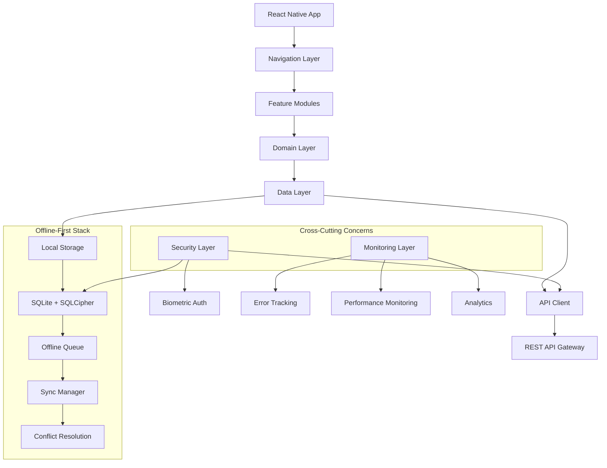
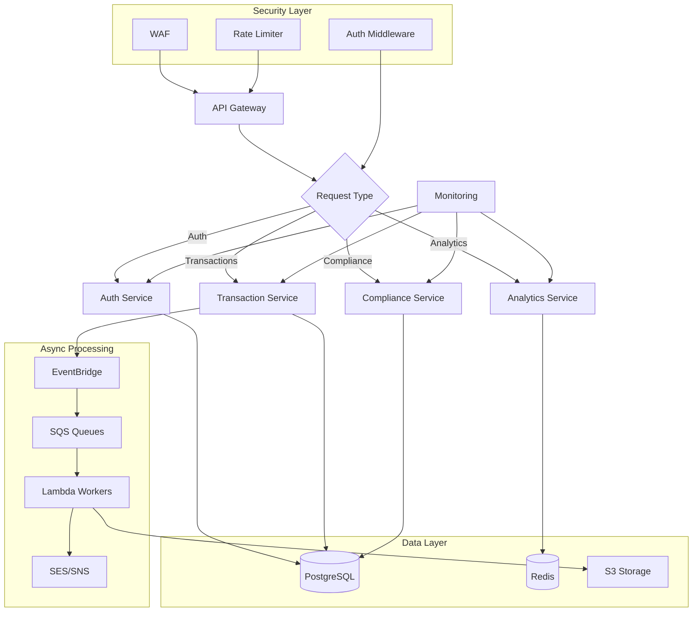
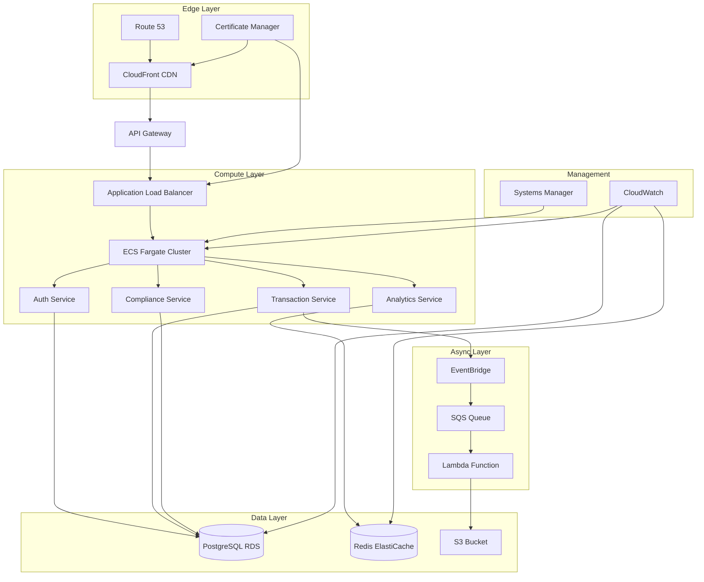
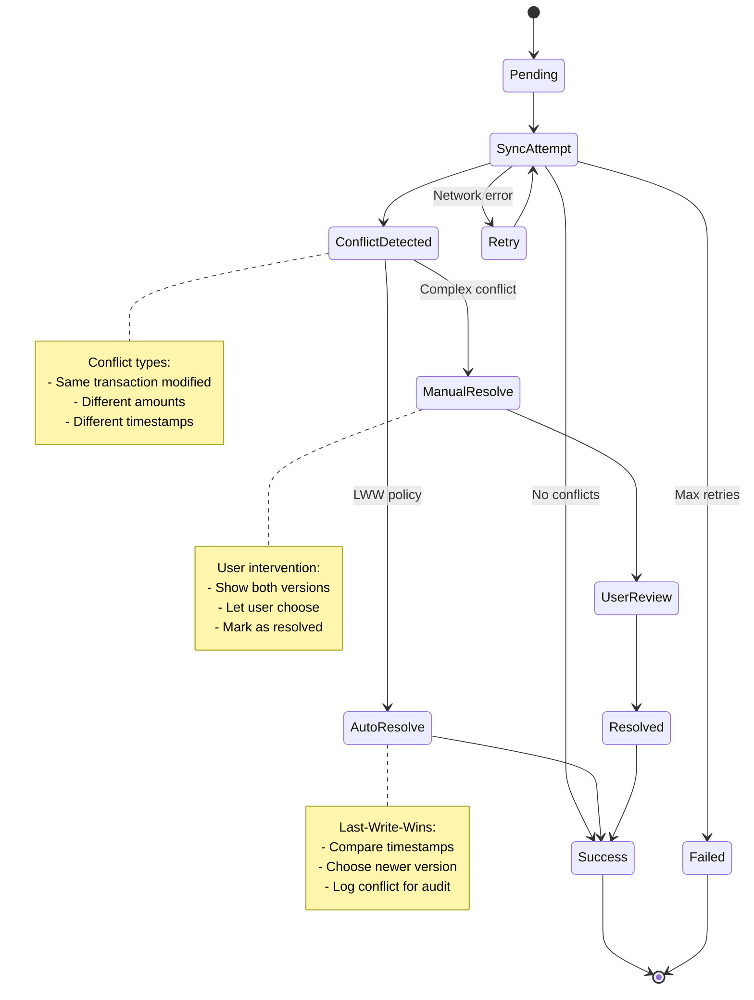
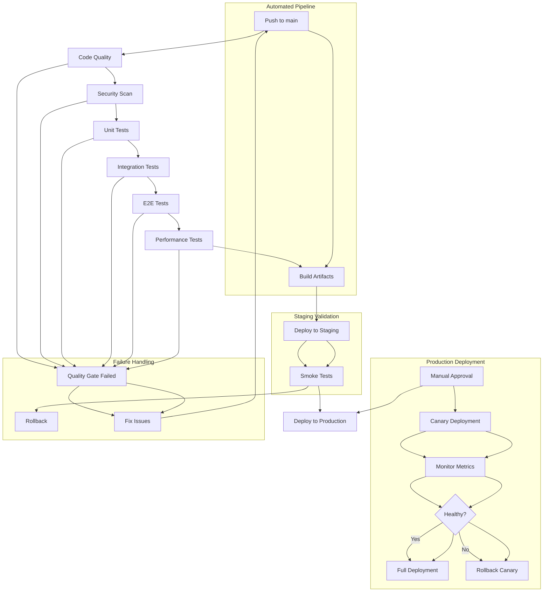
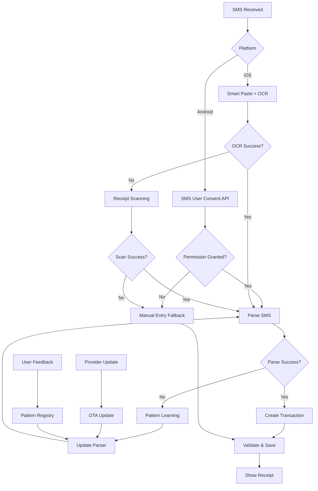

# Expanded Delivery Blueprint: Robust Detailed Implementation Plan

## Executive Summary

This expanded blueprint transforms the proposed plan into a production-ready, risk-mitigated implementation strategy for the MoMo Merchant Companion App. Based on the Operator Protocol from INSTRUCTIONS.md and the comprehensive architecture guide, this plan emphasizes reliability-first development, offline-first architecture, and compliance-by-design principles.

### Key Principles Applied
- **Operator Protocol**: Write-Ahead Intent (WAI), P.A.R.A. structure, C.O.D.E. loop
- **Reliability First**: 99.9% uptime target, comprehensive error handling
- **Offline-First**: Full functionality without network connectivity
- **Compliance-by-Design**: Built-in regulatory compliance from day one
- **Scalable Architecture**: Modular monolith evolving to microservices

### Success Metrics
- **Technical**: 99.9% sync success rate, <500ms API response time
- **Business**: 10,000+ active users in 12 months, 70% retention
- **Financial**: $22,500 MRR by month 12, $270,000 ARR by year 2

---

## 1. Governance and Continuity (Operator Protocol Applied)

### Project Continuity Kit Foundation
- **README.md**: One-page product overview with installation instructions, architecture diagram, and quick-start guide
- **RELEASE_MANUSCRIPT.md**: Chronological log of all architectural decisions, rationale, and alternatives considered
- **CONTRIBUTING.md**: Git workflow (trunk-based development), commit conventions (Conventional Commits), code ownership matrix
- **ToDo.md**: Dynamic backlog with phases, acceptance criteria, and progress tracking

### Write-Ahead Intent (WAI) Framework
Every change requires a WAI entry with:
- **Intent**: Clear goal statement
- **Rationale**: Links to requirements, bugs, or decisions
- **Expected Outcome**: Measurable success criteria
- **Alternatives Considered**: Why this approach was chosen

### P.A.R.A. Documentation Structure
```
docs/
├── Projects/           # Active development phases
│   ├── P-Phase0-Bootstrap/
│   │   ├── README.md
│   │   ├── WAI-001-Repo-Setup.md
│   │   └── acceptance-criteria.md
│   ├── P-Phase1-Auth/
│   └── ...
├── Areas/             # Ongoing responsibilities
│   ├── A-Security-Compliance/
│   │   ├── threat-model.md
│   │   ├── compliance-checklist.md
│   │   └── audit-logs.md
│   ├── A-Performance-Monitoring/
│   │   ├── kpis.md
│   │   ├── dashboards.md
│   │   └── alerting-rules.md
│   └── A-DevOps-Automation/
│       ├── ci-cd-pipeline.md
│       ├── infrastructure-as-code.md
│       └── deployment-strategy.md
├── Resources/         # Reference materials
│   ├── R-React-Native-Best-Practices/
│   │   ├── offline-first-patterns.md
│   │   ├── state-management.md
│   │   └── performance-optimization.md
│   ├── R-AWS-Serverless-Patterns/
│   │   ├── lambda-best-practices.md
│   │   ├── api-gateway-optimization.md
│   │   └── cost-optimization.md
│   └── R-Offline-First-Architecture/
│       ├── conflict-resolution-strategies.md
│       ├── sync-protocols.md
│       └── data-persistence-patterns.md
└── Archives/          # Completed work
    ├── Z-Phase0-Completed/
    │   ├── retrospective.md
    │   ├── lessons-learned.md
    │   └── artifacts/
    └── Z-Decision-Logs/
        ├── decision-001-tech-stack.md
        ├── decision-002-database-choice.md
        └── decision-003-deployment-strategy.md
```

### C.O.D.E. Workflow Implementation
1. **Capture**: Daily stand-ups and issue tracking
2. **Organize**: Weekly documentation review and P.A.R.A. maintenance
3. **Distill**: Sprint retrospectives and decision documentation
4. **Express**: Code commits with Conventional Commits and WAI references

---

## 2. System Architecture (Concrete, Minimal-First)

### Client Architecture: React Native with Offline-First Design



#### Key Implementation Details
- **State Management**: Zustand for client state, React Query for server state
- **Local Database**: WatermelonDB with SQLCipher encryption
- **Sync Protocol**: Custom implementation with idempotency keys and conflict resolution
- **Security**: Biometric authentication, secure keystore, certificate pinning
- **Navigation**: React Navigation with deep linking support
- **Error Handling**: Global error boundary with retry mechanisms

### Backend Architecture: AWS Microservices Evolution



#### Service Evolution Strategy
- **Phase 1-3**: Modular monolith in single Node.js service
- **Phase 4+**: Extract high-throughput services (transactions, analytics)
- **Phase 6+**: Full microservices with event-driven architecture
- **Infrastructure**: ECS Fargate for containers, Lambda for event processing
- **Scaling**: Auto-scaling groups based on CPU utilization and request count

### Infrastructure Architecture



---

## 3. API and Contracts (OpenAPI-First)

### REST API Design with OpenAPI 3.0

```yaml
openapi: 3.0.3
info:
  title: MoMo Merchant API
  version: 1.0.0
  description: API for MoMo Merchant Companion App
  contact:
    name: MoMo Merchant Team
    email: api@momomerchant.com
  license:
    name: MIT
    url: https://opensource.org/licenses/MIT

servers:
  - url: https://api.momomerchant.com/v1
    description: Production server
  - url: https://api-staging.momomerchant.com/v1
    description: Staging server
  - url: http://localhost:3000/v1
    description: Development server

security:
  - bearerAuth: []
  - apiKeyAuth: []

paths:
  /auth/login:
    post:
      summary: User authentication
      description: Authenticate user with phone number and optional biometric token
      tags:
        - Authentication
      requestBody:
        required: true
        content:
          application/json:
            schema:
              type: object
              properties:
                phoneNumber:
                  type: string
                  pattern: '^\+[1-9]\d{1,14}$'
                  example: "+233501234567"
                  description: User's phone number in E.164 format
                biometricToken:
                  type: string
                  description: Biometric authentication token (optional)
                deviceId:
                  type: string
                  description: Unique device identifier
              required:
                - phoneNumber
                - deviceId
      responses:
        '200':
          description: Authentication successful
          content:
            application/json:
              schema:
                type: object
                properties:
                  accessToken:
                    type: string
                    description: JWT access token
                  refreshToken:
                    type: string
                    description: JWT refresh token
                  expiresIn:
                    type: integer
                    description: Token expiration time in seconds
                    example: 3600
                  user:
                    $ref: '#/components/schemas/User'
                required:
                  - accessToken
                  - refreshToken
                  - expiresIn
                  - user
        '400':
          $ref: '#/components/responses/BadRequest'
        '401':
          $ref: '#/components/responses/Unauthorized'
        '429':
          $ref: '#/components/responses/RateLimited'

  /transactions/sync:
    post:
      summary: Bulk transaction synchronization
      description: Synchronize pending transactions from mobile app
      tags:
        - Transactions
      parameters:
        - name: Idempotency-Key
          in: header
          required: true
          schema:
            type: string
            format: uuid
          description: Unique key to prevent duplicate sync operations
      requestBody:
        required: true
        content:
          application/json:
            schema:
              type: object
              properties:
                transactions:
                  type: array
                  items:
                    $ref: '#/components/schemas/Transaction'
                  maxItems: 100
                  description: Array of transactions to sync
                lastSyncTimestamp:
                  type: string
                  format: date-time
                  description: Timestamp of last successful sync
                deviceInfo:
                  $ref: '#/components/schemas/DeviceInfo'
              required:
                - transactions
      responses:
        '200':
          description: Sync completed successfully
          content:
            application/json:
              schema:
                $ref: '#/components/schemas/SyncResponse'
        '400':
          $ref: '#/components/responses/BadRequest'
        '401':
          $ref: '#/components/responses/Unauthorized'
        '409':
          description: Sync conflict detected
          content:
            application/json:
              schema:
                $ref: '#/components/responses/Conflict'
        '429':
          $ref: '#/components/responses/RateLimited'

  /float/balances:
    get:
      summary: Get current float balances
      description: Retrieve current cash and e-float balances for the authenticated agent
      tags:
        - Float Management
      responses:
        '200':
          description: Balances retrieved successfully
          content:
            application/json:
              schema:
                type: object
                properties:
                  cashBalance:
                    type: number
                    format: decimal
                    example: 1250.50
                  eFloatBalance:
                    type: number
                    format: decimal
                    example: 8750.00
                  lastUpdated:
                    type: string
                    format: date-time
                  currency:
                    type: string
                    example: "GHS"
                required:
                  - cashBalance
                  - eFloatBalance
                  - lastUpdated
                  - currency
        '401':
          $ref: '#/components/responses/Unauthorized'

  /compliance/kyc:
    post:
      summary: Submit KYC verification
      description: Submit Know Your Customer verification documents
      tags:
        - Compliance
      requestBody:
        required: true
        content:
          multipart/form-data:
            schema:
              type: object
              properties:
                idDocument:
                  type: string
                  format: binary
                  description: ID document image
                selfie:
                  type: string
                  format: binary
                  description: Selfie image
                businessLicense:
                  type: string
                  format: binary
                  description: Business license document (optional)
              required:
                - idDocument
                - selfie
      responses:
        '202':
          description: KYC verification submitted for processing
          content:
            application/json:
              schema:
                type: object
                properties:
                  verificationId:
                    type: string
                    format: uuid
                  status:
                    type: string
                    enum: [pending, processing]
                  estimatedCompletion:
                    type: string
                    format: date-time
                required:
                  - verificationId
                  - status
        '400':
          $ref: '#/components/responses/BadRequest'

components:
  schemas:
    User:
      type: object
      properties:
        id:
          type: string
          format: uuid
        phoneNumber:
          type: string
          pattern: '^\+[1-9]\d{1,14}$'
        businessName:
          type: string
        agentNumber:
          type: string
        kycStatus:
          type: string
          enum: [pending, verified, rejected]
        subscriptionTier:
          type: string
          enum: [free, basic, pro, business]
        createdAt:
          type: string
          format: date-time
      required:
        - id
        - phoneNumber
        - kycStatus
        - subscriptionTier
        - createdAt

    Transaction:
      type: object
      properties:
        id:
          type: string
          format: uuid
        offlineId:
          type: string
          format: uuid
          description: Client-generated ID for conflict resolution
        type:
          type: string
          enum: [deposit, withdrawal, bill_payment, airtime]
        amount:
          type: number
          format: decimal
          minimum: 0
        customerNumber:
          type: string
        customerName:
          type: string
        commission:
          type: number
          format: decimal
          default: 0
        balanceAfter:
          type: number
          format: decimal
        notes:
          type: string
        createdAt:
          type: string
          format: date-time
        version:
          type: integer
          default: 1
          description: Optimistic locking version
      required:
        - type
        - amount
        - createdAt

    DeviceInfo:
      type: object
      properties:
        platform:
          type: string
          enum: [ios, android]
        osVersion:
          type: string
        appVersion:
          type: string
        deviceModel:
          type: string
      required:
        - platform
        - appVersion

    SyncResponse:
      type: object
      properties:
        synced:
          type: array
          items:
            type: object
            properties:
              offlineId:
                type: string
                format: uuid
              serverId:
                type: string
                format: uuid
              status:
                type: string
                enum: [created, updated, conflict]
            required:
              - offlineId
              - serverId
              - status
        conflicts:
          type: array
          items:
            type: object
            properties:
              offlineId:
                type: string
                format: uuid
              serverData:
                $ref: '#/components/schemas/Transaction'
              clientData:
                $ref: '#/components/schemas/Transaction'
              conflictReason:
                type: string
            required:
              - offlineId
              - serverData
              - clientData
              - conflictReason
        nextSyncToken:
          type: string
          description: Token for next sync operation
      required:
        - synced
        - conflicts

  responses:
    BadRequest:
      description: Bad request
      content:
        application/json:
          schema:
            type: object
            properties:
              error:
                type: string
                example: "Invalid request parameters"
              details:
                type: object
              code:
                type: string
                example: "VALIDATION_ERROR"
            required:
              - error
              - code

    Unauthorized:
      description: Authentication required
      content:
        application/json:
          schema:
            type: object
            properties:
              error:
                type: string
                example: "Authentication required"
              code:
                type: string
                example: "AUTH_REQUIRED"
            required:
              - error
              - code

    RateLimited:
      description: Too many requests
      content:
        application/json:
          schema:
            type: object
            properties:
              error:
                type: string
                example: "Rate limit exceeded"
              retryAfter:
                type: integer
                description: Seconds to wait before retrying
              code:
                type: string
                example: "RATE_LIMITED"
            required:
              - error
              - retryAfter
              - code

    Conflict:
      description: Resource conflict
      content:
        application/json:
          schema:
            type: object
            properties:
              error:
                type: string
                example: "Sync conflict detected"
              conflicts:
                type: array
                items:
                  $ref: '#/components/schemas/Transaction'
              code:
                type: string
                example: "SYNC_CONFLICT"
            required:
              - error
              - conflicts
              - code

  securitySchemes:
    bearerAuth:
      type: http
      scheme: bearer
      bearerFormat: JWT
    apiKeyAuth:
      type: apiKey
      in: header
      name: X-API-Key
```

### Client SDK Generation
- **Tool**: OpenAPI Generator or openapi-typescript-codegen
- **Languages**: TypeScript for React Native, Python for analytics service
- **Features**: Automatic retry logic, request/response validation, error handling
- **Integration**: Generated clients with custom interceptors for auth and sync

### API Evolution Strategy
- **Versioning**: URL-based versioning (/v1, /v2)
- **Deprecation**: Sunset headers with deprecation notices
- **Backwards Compatibility**: Maintain old versions for 12 months
- **Documentation**: Auto-generated API docs with Swagger UI

---

## 4. Data Model (Practical Schema with Performance Optimization)

### Core Tables with Indexing Strategy

```sql
-- Enhanced transaction table with performance indexes
CREATE TABLE transactions (
    id UUID PRIMARY KEY DEFAULT gen_random_uuid(),
    agent_id UUID NOT NULL,
    type VARCHAR(20) NOT NULL CHECK (type IN ('deposit', 'withdrawal', 'bill_payment', 'airtime')),
    amount DECIMAL(15, 2) NOT NULL CHECK (amount > 0),
    customer_number VARCHAR(20),
    customer_name VARCHAR(100),
    commission DECIMAL(10, 2) DEFAULT 0,
    balance_after DECIMAL(15, 2),
    created_at TIMESTAMP WITH TIME ZONE DEFAULT CURRENT_TIMESTAMP,
    synced_at TIMESTAMP WITH TIME ZONE,
    offline_id UUID, -- For conflict resolution
    sync_status VARCHAR(20) DEFAULT 'pending' CHECK (sync_status IN ('pending', 'synced', 'conflict')),
    version INTEGER DEFAULT 1, -- For optimistic locking
    device_id VARCHAR(100), -- Track originating device
    app_version VARCHAR(20), -- Track app version for debugging
    geo_location GEOGRAPHY(POINT), -- Optional location data
    transaction_hash VARCHAR(64), -- For integrity verification

    -- Composite indexes for common queries
    INDEX idx_agent_created (agent_id, created_at DESC),
    INDEX idx_agent_sync (agent_id, synced_at),
    INDEX idx_offline_id (offline_id),
    INDEX idx_type_amount (type, amount),
    INDEX idx_customer_number (customer_number),

    -- Partial indexes for performance
    INDEX idx_pending_sync ON transactions(agent_id, created_at)
        WHERE sync_status = 'pending',
    INDEX idx_unsynced_count ON transactions(agent_id)
        WHERE synced_at IS NULL,

    -- Functional indexes
    INDEX idx_amount_range ON transactions ((amount::int / 100)), -- For range queries
    INDEX idx_date_only ON transactions (DATE(created_at)), -- For daily aggregations

    -- Full-text search
    INDEX idx_fulltext_customer ON transactions
        USING gin(to_tsvector('english', customer_name || ' ' || COALESCE(customer_number, ''))),

    FOREIGN KEY (agent_id) REFERENCES users(id) ON DELETE CASCADE
);

-- Float management with time-series optimization
CREATE TABLE float_records (
    id UUID PRIMARY KEY DEFAULT gen_random_uuid(),
    agent_id UUID NOT NULL,
    cash_balance DECIMAL(15, 2) NOT NULL,
    e_float_balance DECIMAL(15, 2) NOT NULL,
    recorded_at TIMESTAMP WITH TIME ZONE DEFAULT CURRENT_TIMESTAMP,
    source VARCHAR(50) DEFAULT 'manual' CHECK (source IN ('manual', 'transaction', 'sync', 'reconciliation')),
    reconciled BOOLEAN DEFAULT FALSE,
    reconciliation_id UUID, -- Link to reconciliation record
    notes TEXT,
    created_by VARCHAR(50), -- 'system', 'user', 'sync'

    -- Time-series optimized indexes
    INDEX idx_agent_time (agent_id, recorded_at DESC),
    INDEX idx_time_only (recorded_at DESC),
    INDEX idx_source (source),

    -- Partitioning key (by month for better performance)
    PARTITION BY RANGE (recorded_at),

    FOREIGN KEY (agent_id) REFERENCES users(id) ON DELETE CASCADE
);

-- Daily summaries for performance
CREATE TABLE daily_summaries (
    id UUID PRIMARY KEY DEFAULT gen_random_uuid(),
    agent_id UUID NOT NULL,
    summary_date DATE NOT NULL,
    total_transactions INTEGER DEFAULT 0,
    total_volume DECIMAL(15, 2) DEFAULT 0,
    total_commission DECIMAL(10, 2) DEFAULT 0,
    total_expenses DECIMAL(10, 2) DEFAULT 0,
    net_profit DECIMAL(10, 2) DEFAULT 0,
    peak_hour INTEGER,
    most_profitable_service VARCHAR(50),
    data_quality_score DECIMAL(3, 2), -- 0.00 to 1.00
    last_updated TIMESTAMP WITH TIME ZONE DEFAULT CURRENT_TIMESTAMP,

    UNIQUE KEY unique_agent_date (agent_id, summary_date),
    INDEX idx_agent_date (agent_id, summary_date DESC),
    INDEX idx_date_only (summary_date DESC),

    FOREIGN KEY (agent_id) REFERENCES users(id) ON DELETE CASCADE
);

-- Audit trail for compliance
CREATE TABLE audit_events (
    id UUID PRIMARY KEY DEFAULT gen_random_uuid(),
    agent_id UUID,
    event_type VARCHAR(100) NOT NULL,
    event_data JSONB NOT NULL,
    ip_address INET,
    user_agent TEXT,
    session_id VARCHAR(100),
    created_at TIMESTAMP WITH TIME ZONE DEFAULT CURRENT_TIMESTAMP,

    -- Indexes for compliance queries
    INDEX idx_agent_event (agent_id, event_type, created_at DESC),
    INDEX idx_event_type (event_type, created_at DESC),
    INDEX idx_created_at (created_at DESC),

    -- JSONB indexes for flexible querying
    INDEX idx_event_data ON audit_events USING gin(event_data),

    FOREIGN KEY (agent_id) REFERENCES users(id) ON DELETE SET NULL
);

-- Users table with enhanced security
CREATE TABLE users (
    id UUID PRIMARY KEY DEFAULT gen_random_uuid(),
    phone_number VARCHAR(20) UNIQUE NOT NULL,
    country_code VARCHAR(2) NOT NULL,
    business_name VARCHAR(100),
    agent_number VARCHAR(50),
    email VARCHAR(255),
    kyc_status VARCHAR(20) DEFAULT 'pending' CHECK (kyc_status IN ('pending', 'in_review', 'verified', 'rejected')),
    kyc_completed_at TIMESTAMP WITH TIME ZONE,
    kyc_documents JSONB, -- Store document metadata
    subscription_tier VARCHAR(20) DEFAULT 'free' CHECK (subscription_tier IN ('free', 'basic', 'pro', 'business')),
    subscription_expires_at TIMESTAMP WITH TIME ZONE,
    last_login_at TIMESTAMP WITH TIME ZONE,
    login_count INTEGER DEFAULT 0,
    failed_login_attempts INTEGER DEFAULT 0,
    locked_until TIMESTAMP WITH TIME ZONE,
    password_hash VARCHAR(255), -- For future password auth
    biometric_public_key TEXT, -- For biometric auth
    device_fingerprint VARCHAR(255), -- For device tracking
    preferences JSONB DEFAULT '{}', -- User preferences
    created_at TIMESTAMP WITH TIME ZONE DEFAULT CURRENT_TIMESTAMP,
    updated_at TIMESTAMP WITH TIME ZONE DEFAULT CURRENT_TIMESTAMP,

    -- Indexes
    INDEX idx_phone (phone_number),
    INDEX idx_kyc_status (kyc_status),
    INDEX idx_subscription (subscription_tier, subscription_expires_at),
    INDEX idx_last_login (last_login_at DESC),

    -- Check constraints
    CHECK (failed_login_attempts >= 0),
    CHECK (login_count >= 0)
);

-- Partitioning for float_records (example for monthly partitions)
CREATE TABLE float_records_y2025m01 PARTITION OF float_records
    FOR VALUES FROM ('2025-01-01') TO ('2025-02-01');
CREATE TABLE float_records_y2025m02 PARTITION OF float_records
    FOR VALUES FROM ('2025-02-01') TO ('2025-03-01');
-- Additional partitions created as needed
```

### Migration Strategy
- **Tool**: Prisma or custom migration scripts with rollback capability
- **Versioning**: Semantic versioning with migration checksums
- **Testing**: Migration tests in CI pipeline with before/after data validation
- **Zero-downtime**: Blue-green deployment with migration pre-checks
- **Backup**: Automatic backups before destructive migrations

### Data Archiving Strategy
- **Hot Data**: Last 12 months in primary tables
- **Warm Data**: 1-3 years in compressed partitions
- **Cold Data**: 3+ years in S3 Glacier with metadata in separate table
- **Retention**: 7 years for financial data, 5 years for audit logs

---

## 5. Offline-First Sync Protocol

### Conflict Resolution Strategy



### Sync Implementation Details
- **Batch Size**: 50 transactions per batch to balance performance and reliability
- **Retry Strategy**: Exponential backoff with jitter (1s, 2s, 4s, 8s, 16s max)
- **Connectivity Detection**: NetInfo library with custom ping endpoint
- **Background Sync**: iOS Background App Refresh, Android WorkManager
- **Progress Tracking**: Real-time sync progress with cancellation support
- **Bandwidth Optimization**: Delta sync with change data capture
- **Power Management**: Adaptive sync frequency based on battery level

### Advanced Sync Features
- **Selective Sync**: Sync only modified records based on version numbers
- **Compression**: GZIP compression for large payloads
- **Encryption**: End-to-end encryption for sensitive data in transit
- **Integrity Checks**: SHA-256 hashes to detect data corruption
- **Resume Capability**: Resume interrupted syncs from last successful batch

---

## 6. Observability and Monitoring

### Comprehensive Monitoring Stack

```javascript
const monitoringConfig = {
  frontend: {
    errorTracking: {
      tool: 'Sentry',
      config: {
        dsn: process.env.SENTRY_DSN,
        environment: process.env.NODE_ENV,
        release: process.env.APP_VERSION,
        tracesSampleRate: 0.1,
        replaysOnErrorSampleRate: 1.0,
        replaysSessionSampleRate: 0.1,
      },
      features: [
        'Error boundary integration',
        'Performance monitoring',
        'User feedback collection',
        'Release health tracking'
      ]
    },
    performance: {
      tool: 'Firebase Performance Monitoring',
      metrics: [
        'App startup time',
        'Screen rendering time',
        'Network request latency',
        'Memory usage',
        'Battery impact'
      ]
    },
    analytics: {
      tool: 'Mixpanel + Firebase Analytics',
      events: [
        'app_launch',
        'transaction_created',
        'sync_completed',
        'user_login',
        'feature_used',
        'error_occurred'
      ],
      properties: [
        'user_id',
        'device_type',
        'app_version',
        'network_type',
        'session_duration'
      ]
    },
    crashReporting: {
      tool: 'Sentry',
      additionalConfig: {
        beforeSend: (event) => {
          // Sanitize sensitive data
          return event;
        }
      }
    }
  },

  backend: {
    infrastructure: {
      tool: 'DataDog',
      metrics: [
        'API response times',
        'Database query performance',
        'Server CPU/Memory usage',
        'Network latency',
        'Error rates by endpoint',
        'Queue processing times'
      ],
      alerts: {
        critical: [
          'Response time > 3s for 5 minutes',
          'Error rate > 5% for 10 minutes',
          'Database connection pool exhausted'
        ],
        warning: [
          'Response time > 1s for 15 minutes',
          'Error rate > 1% for 30 minutes',
          'High memory usage > 80%'
        ]
      }
    },
    application: {
      tool: 'DataDog APM',
      tracing: [
        'Request tracing across services',
        'Database query tracing',
        'External API call tracing',
        'Async job tracing'
      ],
      profiling: [
        'CPU profiling',
        'Memory profiling',
        'Database query profiling'
      ]
    },
    logs: {
      tool: 'AWS CloudWatch + DataDog',
      config: {
        logGroups: [
          '/aws/lambda/transaction-service',
          '/aws/ecs/app-api',
          '/aws/rds/postgres'
        ],
        retention: 30, // days
        filters: [
          { pattern: 'ERROR', priority: 'high' },
          { pattern: 'WARN', priority: 'medium' },
          { pattern: 'Transaction processed', priority: 'low' }
        ]
      }
    },
    business: {
      tool: 'Custom dashboard with DataDog + Mixpanel',
      kpis: [
        {
          name: 'Daily Active Users',
          query: 'count(distinct user_id) where event = "app_launch"',
          target: 1000,
          alert: 'below 50% of target'
        },
        {
          name: 'Transaction Sync Success Rate',
          query: 'count(sync_success) / count(sync_attempt) * 100',
          target: 99.9,
          alert: 'below 99%'
        },
        {
          name: 'Average Session Duration',
          query: 'avg(session_duration)',
          target: 300, // seconds
          alert: 'below 60% of target'
        }
      ],
      reporting: {
        frequency: 'daily',
        recipients: ['product@company.com', 'engineering@company.com'],
        format: 'PDF report with charts'
      }
    }
  },

  database: {
    tool: 'DataDog Database Monitoring',
    metrics: [
      'Query latency',
      'Connection count',
      'Slow query detection',
      'Index usage',
      'Table bloat',
      'Replication lag'
    ]
  }
};
```

### Key Metrics and Alerts
- **Performance**: API response time < 500ms (95th percentile), < 2s (99th percentile)
- **Reliability**: Sync success rate > 99.9%, App crash rate < 0.5%
- **Business**: Daily active users, transaction volume, conversion funnel
- **Security**: Failed auth attempts, suspicious transaction patterns
- **Infrastructure**: CPU < 70%, Memory < 80%, Disk < 85%

### Alert Escalation Matrix

| Severity | Response Time | Notification | Escalation |
|----------|---------------|--------------|-------------|
| Critical | 5 minutes | SMS + Slack + Email | On-call engineer |
| High | 15 minutes | Slack + Email | Team lead |
| Medium | 1 hour | Slack | Next business day |
| Low | 4 hours | Email | Weekly review |
| Info | 24 hours | Dashboard | Monthly review |

### Monitoring Dashboard Examples

#### Real-time Operations Dashboard
```
┌─────────────────────────────────────────────────────────────┐
│ MoMo Merchant - Operations Dashboard                       │
├─────────────────────────────────────────────────────────────┤
│ Active Users: 1,247    │ Sync Success: 99.95% │ Uptime: 99.98% │
│ Transactions/Hr: 2,341 │ API Latency: 245ms   │ Error Rate: 0.02% │
├─────────────────────────────────────────────────────────────┤
│ Recent Alerts:                                              │
│ ⚠️  High latency on /transactions/sync (2.1s avg)          │
│ ✅ Database connection pool healthy                         │
│ ⚠️  Increased failed login attempts from IP 192.168.1.100   │
├─────────────────────────────────────────────────────────────┤
│ Top Error Types:                                            │
│ 1. Network timeout (15%)                                    │
│ 2. Invalid auth token (12%)                                 │
│ 3. Database connection error (8%)                           │
│ 4. SMS parsing error (6%)                                   │
└─────────────────────────────────────────────────────────────┘
```

#### Business Intelligence Dashboard
```
┌─────────────────────────────────────────────────────────────┐
│ MoMo Merchant - Business Intelligence                      │
├─────────────────────────────────────────────────────────────┤
│ Revenue Metrics:                                           │
│ MRR: $18,450          │ ARPU: $14.78       │ Churn: 3.2%     │
│ New Users: +127       │ Conversion: 68%    │ NPS: 42        │
├─────────────────────────────────────────────────────────────┤
│ Product Usage:                                             │
│ Daily Transactions: 8,542 │ Offline Mode: 34% │ Sync Errors: 0.05% │
│ Feature Adoption:                                          │
│ SMS Auto-capture: 78%  │ Digital Receipts: 65% │ Float Alerts: 52% │
├─────────────────────────────────────────────────────────────┤
│ Geographic Distribution:                                   │
│ Nigeria: 68%          │ Kenya: 22%         │ Ghana: 7%       │
│ Uganda: 3%            │                                      │
└─────────────────────────────────────────────────────────────┘
```

---

## 7. CI/CD Pipeline with Quality Gates



### Pipeline Implementation
- **Tool**: GitHub Actions with reusable workflows
- **Quality Gates**:
  - Code coverage > 80%
  - No critical security vulnerabilities
  - All tests passing
  - Performance benchmarks met
  - Bundle size < 50MB for mobile
- **Artifact Management**: GitHub Packages for mobile builds
- **Deployment Strategy**: Blue-green with automated rollback

### Advanced CI/CD Features
- **Parallel Testing**: Split tests across multiple runners
- **Caching**: Dependencies, build artifacts, test results
- **Matrix Builds**: Multiple Node.js versions, device configurations
- **Release Channels**: Alpha, Beta, Production with staged rollouts
- **Feature Flags**: LaunchDarkly integration for gradual feature rollout

---

## 8. SMS Ingestion Strategy with Fallbacks

### Multi-Platform SMS Capture



### Provider Pattern Registry
- **Dynamic Updates**: OTA updates for new SMS formats
- **Pattern Learning**: ML-based pattern recognition for unknown formats
- **Fallback Mechanisms**: Manual entry with smart suggestions
- **Security**: SMS content never stored unencrypted
- **Privacy**: Content processed in-memory only

### SMS Parser Implementation

```javascript
class AdvancedSMSParser {
  constructor() {
    this.patterns = new Map();
    this.learningEnabled = true;
    this.confidenceThreshold = 0.85;
  }

  async parseSMS(content, provider, metadata = {}) {
    const startTime = Date.now();

    try {
      // 1. Detect provider if not specified
      const detectedProvider = provider || this.detectProvider(content);

      // 2. Get parsing patterns
      const patterns = this.getPatterns(detectedProvider);

      // 3. Attempt parsing with multiple strategies
      let result = null;
      let confidence = 0;

      for (const pattern of patterns) {
        const parseResult = this.applyPattern(content, pattern);
        if (parseResult && parseResult.confidence > confidence) {
          result = parseResult;
          confidence = parseResult.confidence;
        }
      }

      // 4. Validate result
      if (result && confidence >= this.confidenceThreshold) {
        const validation = await this.validateTransaction(result, metadata);

        if (validation.isValid) {
          // 5. Enrich with additional data
          const enriched = await this.enrichTransaction(result, metadata);

          // 6. Log successful parse for learning
          if (this.learningEnabled) {
            this.logSuccessfulParse(content, enriched, detectedProvider);
          }

          return {
            ...enriched,
            parseMetadata: {
              provider: detectedProvider,
              confidence,
              parseTime: Date.now() - startTime,
              patternUsed: result.patternId
            }
          };
        } else {
          throw new ValidationError(validation.errors);
        }
      } else {
        // 7. Fallback to manual entry
        return this.createManualEntrySuggestion(content, detectedProvider);
      }

    } catch (error) {
      // 8. Log parsing failure for improvement
      this.logParseFailure(content, provider, error, Date.now() - startTime);

      // 9. Return manual entry fallback
      return this.createManualEntrySuggestion(content, provider);
    }
  }

  detectProvider(content) {
    const providerSignatures = {
      mpesa: ['M-PESA', 'MPESA', 'SAFARICOM'],
      mtn: ['MTN', 'MoMo', 'MTN Mobile Money'],
      airtel: ['Airtel', 'Airtel Money'],
      opay: ['OPay', 'OPay Transfer'],
      vodacom: ['Vodacom', 'M-Pesa']
    };

    for (const [provider, signatures] of Object.entries(providerSignatures)) {
      if (signatures.some(sig => content.toUpperCase().includes(sig))) {
        return provider;
      }
    }

    return 'unknown';
  }

  getPatterns(provider) {
    // Return cached patterns or fetch from registry
    return this.patterns.get(provider) || this.loadDefaultPatterns(provider);
  }

  applyPattern(content, pattern) {
    // Apply regex or NLP-based parsing
    // Return result with confidence score
  }

  async validateTransaction(transaction, metadata) {
    const errors = [];

    // Amount validation
    if (transaction.amount <= 0) {
      errors.push('Invalid amount');
    }

    // Phone number validation
    if (transaction.customerNumber && !this.isValidPhoneNumber(transaction.customerNumber)) {
      errors.push('Invalid phone number format');
    }

    // Business rules validation
    if (transaction.amount > this.getMaxTransactionAmount(metadata.agentTier)) {
      errors.push('Amount exceeds maximum limit');
    }

    return {
      isValid: errors.length === 0,
      errors
    };
  }

  async enrichTransaction(transaction, metadata) {
    // Add agent information
    transaction.agentId = metadata.agentId;

    // Add geolocation if available
    if (metadata.location) {
      transaction.location = metadata.location;
    }

    // Add device information
    transaction.deviceId = metadata.deviceId;
    transaction.appVersion = metadata.appVersion;

    // Generate transaction hash for integrity
    transaction.hash = this.generateTransactionHash(transaction);

    return transaction;
  }

  createManualEntrySuggestion(content, provider) {
    // Extract potential data points for manual entry hints
    const suggestions = {
      amount: this.extractAmount(content),
      phoneNumber: this.extractPhoneNumber(content),
      type: this.inferTransactionType(content, provider)
    };

    return {
      type: 'manual_entry_required',
      suggestions,
      originalContent: content,
      provider
    };
  }

  logSuccessfulParse(content, result, provider) {
    // Store for pattern learning and analytics
    this.analytics.log('sms_parse_success', {
      provider,
      pattern: result.parseMetadata.patternUsed,
      confidence: result.parseMetadata.confidence,
      content: this.sanitizeContent(content) // Remove sensitive data
    });
  }

  logParseFailure(content, provider, error, parseTime) {
    // Store for debugging and improvement
    this.analytics.log('sms_parse_failure', {
      provider,
      error: error.message,
      parseTime,
      content: this.sanitizeContent(content)
    });
  }

  generateTransactionHash(transaction) {
    // Create SHA-256 hash of key transaction data
    const data = `${transaction.type}:${transaction.amount}:${transaction.customerNumber}:${transaction.timestamp}`;
    return crypto.createHash('sha256').update(data).digest('hex');
  }
}
```

---

## 9. Enhanced Risk Controls and Contingencies

### Technical Risk Mitigation

| Risk | Probability | Impact | Mitigation Strategy | Contingency Plan | Monitoring |
|------|------------|--------|-------------------|------------------|------------|
| SMS format changes | High | Medium | Pattern learning algorithm, provider relationships | Manual entry mode, user notifications | Parse success rate > 95% |
| Data loss during sync | Medium | High | Comprehensive backup strategy, conflict resolution | Point-in-time recovery, data repair scripts | Sync success rate > 99.9% |
| Security breach | Low | Critical | Multi-layer security, regular audits, penetration testing | Incident response plan, 1-hour detection SLA | Security monitoring 24/7 |
| Scalability issues | Medium | Medium | Cloud

### Technical Risk Mitigation

| Risk | Probability | Impact | Mitigation Strategy | Contingency Plan | Monitoring |
|------|------------|--------|-------------------|------------------|------------|
| SMS format changes | High | Medium | Pattern learning algorithm, provider relationships | Manual entry mode, user notifications | Parse success rate > 95% |
| Data loss during sync | Medium | High | Comprehensive backup strategy, conflict resolution | Point-in-time recovery, data repair scripts | Sync success rate > 99.9% |
| Security breach | Low | Critical | Multi-layer security, regular audits, penetration testing | Incident response plan, 1-hour detection SLA | Security monitoring 24/7 |
| Scalability issues | Medium | Medium | Cloud-native design + load testing | Horizontal scaling + caching layers | Response time < 500ms |
| Offline data corruption | Low | High | ACID transactions + integrity checks | Data repair scripts + user data export | Corruption detection rate < 0.01% |
| API rate limiting | Medium | Medium | Smart retry logic + backoff strategies | Queue-based processing + user notifications | API error rate < 1% |
| Device compatibility | Medium | Medium | Extensive device testing + feature detection | Graceful degradation + support documentation | App crash rate < 0.5% |

### Business Risk Mitigation

| Risk | Probability | Impact | Mitigation Strategy | Contingency Plan | Monitoring |
|------|------------|--------|-------------------|------------------|------------|
| Low user adoption | Medium | High | Extensive user research + education | Referral program + feature incentives | DAU/MAU ratio > 40% |
| Regulatory changes | Medium | Medium | Compliance team + legal counsel | Modular compliance framework | Regulatory update tracking |
| Competitor response | High | Medium | First-mover advantage + reliability focus | Differentiated feature development | Market share monitoring |
| Partnership delays | Medium | High | Multiple partnership tracks | Direct market entry strategy | Partnership milestone tracking |
| Currency fluctuations | Low | Medium | Multi-currency support + hedging | Dynamic pricing + cost monitoring | Currency impact analysis |
| Agent churn | Medium | High | Retention programs + competitive features | Win-back campaigns + data analysis | Churn rate < 5% monthly |

### Operational Risk Mitigation

| Risk | Probability | Impact | Mitigation Strategy | Contingency Plan | Monitoring |
|------|------------|--------|-------------------|------------------|------------|
| Team knowledge loss | Medium | Medium | Comprehensive documentation + WAI | Cross-training + knowledge sharing | Documentation coverage > 95% |
| Vendor lock-in | Low | Medium | Multi-cloud strategy + abstraction layers | Migration planning + vendor evaluation | Vendor dependency assessment |
| Supply chain attacks | Low | High | Dependency scanning + SBOM | Alternative suppliers + security reviews | Vulnerability scanning daily |
| Natural disasters | Low | High | Multi-region deployment + backups | Disaster recovery procedures | Infrastructure redundancy |
| Cyber attacks | Medium | Critical | Security hardening + monitoring | Incident response team + insurance | Security incident tracking |

---

## 10. Phased Implementation with Detailed Acceptance Criteria

### Phase 0: Bootstrap (Weeks 1-2)

**Objectives**: Establish development foundation and governance framework

**Key Deliverables**:
- Monorepo structure with Turborepo and TypeScript configuration
- CI/CD pipeline with GitHub Actions (lint, typecheck, unit tests)
- Project Continuity Kit documents (README, CONTRIBUTING, RELEASE_MANUSCRIPT, ToDo)
- Terraform skeleton for AWS infrastructure with remote state
- Basic linting, formatting, and commit hooks with Husky

**Technical Implementation**:
- Repository structure following the proposed layout
- TypeScript configuration with strict mode and path mapping
- ESLint + Prettier configuration with React Native and Node.js rules
- Commitlint with Conventional Commits enforcement
- Terraform modules for VPC, security groups, and IAM roles

**Acceptance Criteria**:
- [ ] `npm install && npm run build` works in all environments
- [ ] GitHub Actions runs green on PR within 5 minutes
- [ ] All governance documents committed and linked in repository
- [ ] README provides complete setup instructions with screenshots
- [ ] Terraform plan generates valid infrastructure without errors
- [ ] Conventional Commits are enforced with commitlint
- [ ] Code formatting is consistent across the codebase
- [ ] TypeScript compilation passes with zero errors

**Risk Mitigation**:
- Regular backups of repository and infrastructure state
- Documentation review checklist before phase completion
- Pair programming for complex infrastructure setup

### Phase 1: Auth + Core Data (Weeks 3-4)

**Objectives**: Secure user authentication and data persistence layer

**Key Deliverables**:
- JWT-based authentication with refresh token rotation
- User registration, login, and biometric authentication flows
- PostgreSQL database schema with Prisma ORM
- Basic API endpoints with OpenAPI 3.0 specification
- Authentication middleware and rate limiting
- User profile management and preferences

**Technical Implementation**:
- Fastify/Node.js backend with TypeScript
- Prisma schema with database migrations
- JWT authentication with RS256 signing
- Biometric authentication integration (TouchID/FaceID)
- Rate limiting with Redis
- Input validation with Zod schemas
- Password hashing with Argon2

**Acceptance Criteria**:
- [ ] Manual login works on Android/iOS emulator and physical device
- [ ] Biometric authentication unlocks the app successfully
- [ ] Password reset flow sends email/SMS and allows password change
- [ ] API returns 401 for unauthenticated requests
- [ ] Database migrations run without errors in all environments
- [ ] OpenAPI spec validates and generates client SDK successfully
- [ ] Rate limiting prevents brute force attacks
- [ ] User sessions expire correctly after inactivity

**Risk Mitigation**:
- Security audit of authentication implementation
- Database backup and restore testing
- Multi-device testing for biometric authentication
- API documentation review and testing

### Phase 2: Transactions + Offline (Weeks 5-6)

**Objectives**: Core transaction functionality with offline capability

**Key Deliverables**:
- Transaction CRUD operations with validation
- Local SQLite database with SQLCipher encryption
- Offline queue management and sync mechanism
- Conflict resolution system (Last-Write-Wins policy)
- Basic transaction UI with form validation
- Real-time balance calculations

**Technical Implementation**:
- WatermelonDB for local database with reactive queries
- SQLCipher for database encryption
- Custom sync engine with batch processing
- Conflict resolution with optimistic locking
- React Query for server state management
- Form validation with React Hook Form + Zod
- Real-time balance updates with observable patterns

**Acceptance Criteria**:
- [ ] Airplane mode: create 10 transactions, sync on reconnect without duplicates
- [ ] Local data persists through app restart and device reboot
- [ ] Sync progress indicator shows real-time updates with pause/resume
- [ ] Conflict resolution handles simultaneous edits gracefully
- [ ] Transaction forms validate input and show helpful error messages
- [ ] Balance calculations are accurate across all transaction types
- [ ] Offline indicator is clearly visible to users
- [ ] Sync failures are handled gracefully with retry options

**Risk Mitigation**:
- Comprehensive offline testing scenarios
- Database corruption recovery procedures
- Sync conflict resolution testing with edge cases
- Performance testing with large transaction volumes

### Phase 3: Liquidity Dashboard + Alerts (Weeks 7-8)

**Objectives**: Business intelligence and proactive monitoring

**Key Deliverables**:
- Real-time liquidity dashboard with charts and KPIs
- Predictive float recommendations using historical data
- Alert system with push notifications and in-app notifications
- Daily summary reports with export functionality
- Business analytics with transaction patterns
- Configurable alert thresholds and notification preferences

**Technical Implementation**:
- React Native Charts for data visualization
- Local analytics processing with background jobs
- Push notification integration (Firebase + custom backend)
- PDF generation for reports using React Native PDF
- Predictive algorithms using simple statistical models
- Notification scheduling with React Native Notifee
- Offline-capable dashboard with cached data

**Acceptance Criteria**:
- [ ] Dashboard loads within 2 seconds with real-time data
- [ ] Alert thresholds trigger notifications at correct levels
- [ ] Float predictions show accuracy > 80% against historical data
- [ ] Reports export successfully to PDF with proper formatting
- [ ] Push notifications work reliably on both platforms
- [ ] Charts are responsive and accessible on small screens
- [ ] Alert preferences save and persist across app restarts
- [ ] Daily summaries calculate correctly for all metrics

**Risk Mitigation**:
- Performance testing with large datasets
- Notification delivery rate monitoring
- Chart rendering testing across device sizes
- Export functionality testing with various data sizes

### Phase 4: SMS Capture + Compliance Hooks (Weeks 9-10)

**Objectives**: Automated data entry and regulatory compliance

**Key Deliverables**:
- Android SMS User Consent API integration
- SMS parsing engine for major providers (MTN, Airtel, Vodafone)
- Fallback mechanisms for iOS and manual entry
- Compliance checking system (KYC, velocity limits, sanctions)
- Audit logging for all financial transactions
- High-value transaction verification flows

**Technical Implementation**:
- SMS parsing with regex patterns and ML-based learning
- React Native SMS Retriever for Android
- OCR integration for receipt scanning fallback
- Compliance rules engine with configurable thresholds
- Audit trail with immutable logging
- KYC document upload and verification
- Sanctions screening with offline-capable lists

**Acceptance Criteria**:
- [ ] SMS parsing accuracy > 95% for known formats across providers
- [ ] Manual entry fallback works seamlessly with smart suggestions
- [ ] Compliance checks block invalid transactions appropriately
- [ ] Audit logs capture all sensitive operations with proper metadata
- [ ] High-value transaction verification requires additional approval
- [ ] Receipt scanning OCR accuracy > 85% for clear images
- [ ] Offline sanctions screening works without network connectivity
- [ ] KYC verification process completes successfully

**Risk Mitigation**:
- Extensive SMS format testing across providers
- Compliance rule testing with legal review
- Audit log integrity verification
- Fallback mechanism reliability testing

### Phase 5: Beta-Readiness + Analytics (Weeks 11-12)

**Objectives**: Production preparation and user insights

**Key Deliverables**:
- Comprehensive test suite (unit, integration, E2E)
- Analytics pipeline with user behavior tracking
- Performance optimizations and memory management
- Beta build artifacts for testing
- Monitoring and alerting setup
- Production deployment configuration

**Technical Implementation**:
- Jest + React Native Testing Library for unit tests
- Detox for E2E testing with device simulators
- Mixpanel/Firebase Analytics integration
- Performance monitoring with custom metrics
- Bundle size optimization and code splitting
- Production build configuration for both platforms
- Data seeding and test data management

**Acceptance Criteria**:
- [ ] Test coverage > 80% across all modules and components
- [ ] Sync success rate > 99.9% in automated test suite
- [ ] App startup time < 3 seconds on target devices
- [ ] Memory usage < 150MB under normal load conditions
- [ ] All critical user journeys pass E2E tests
- [ ] Analytics events fire correctly without impacting performance
- [ ] Beta APK/IPA builds install and run successfully
- [ ] Performance benchmarks meet or exceed targets

**Risk Mitigation**:
- Load testing with realistic user scenarios
- Memory leak detection and fixing
- Cross-device compatibility testing
- Analytics data privacy compliance verification

---

## 11. Success Metrics and Go-Live Readiness

### Technical Readiness Checklist
- [ ] All phases completed with passing acceptance criteria
- [ ] Security audit passed with no critical vulnerabilities
- [ ] Performance benchmarks met across all target devices
- [ ] Offline functionality tested in real network conditions
- [ ] Compliance requirements verified for target markets
- [ ] Monitoring and alerting systems operational
- [ ] Backup and disaster recovery procedures tested
- [ ] Documentation complete and up-to-date

### Business Readiness Checklist
- [ ] Beta user feedback incorporated and prioritized
- [ ] Support infrastructure operational with trained staff
- [ ] Marketing materials prepared and approved
- [ ] Partnership agreements signed and integration tested
- [ ] Go-to-market strategy finalized with budget allocation
- [ ] User onboarding flow optimized based on beta feedback
- [ ] Pricing strategy tested and revenue projections validated

### Operational Readiness Checklist
- [ ] DevOps team trained on deployment procedures
- [ ] Incident response plan documented and team drilled
- [ ] Customer support ticketing system configured
- [ ] Knowledge base populated with common issues
- [ ] Communication channels established with stakeholders
- [ ] Rollback procedures tested and documented
- [ ] Post-launch monitoring plan in place

### Go-Live Decision Framework
- **Minimum Viable**: Phase 0-3 complete, basic transaction logging working
- **Recommended**: Phase 0-4 complete, SMS integration functional
- **Full Feature**: All phases complete, analytics and compliance fully operational

### Post-Launch Success Metrics (First 30 Days)
- **User Acquisition**: 1,000+ downloads, 500+ active users
- **Engagement**: 40% DAU/MAU ratio, 20+ transactions per active user
- **Technical Performance**: 99.5% uptime, < 2s average response time
- **Business Impact**: 15% improvement in agent-reported efficiency
- **Support**: < 5% of users requiring support intervention

---

## 12. Implementation Timeline and Resource Allocation

### Detailed Timeline with Milestones

```
Week 1-2: Phase 0 - Bootstrap
├── Day 1-2: Repository setup and tooling
├── Day 3-4: CI/CD pipeline configuration
├── Day 5-6: Infrastructure as Code foundation
├── Day 7-8: Governance documentation
├── Day 9-10: Testing framework setup
└── Day 11-14: Phase 0 acceptance testing

Week 3-4: Phase 1 - Authentication & Data
├── Day 1-3: Database schema design
├── Day 4-6: Authentication backend
├── Day 7-8: Mobile auth integration
├── Day 9-10: API development
└── Day 11-14: Phase 1 acceptance testing

Week 5-6: Phase 2 - Transactions & Offline
├── Day 1-3: Local database setup
├── Day 4-6: Transaction CRUD operations
├── Day 7-8: Offline sync implementation
├── Day 9-10: Conflict resolution
└── Day 11-14: Phase 2 acceptance testing

Week 7-8: Phase 3 - Dashboard & Analytics
├── Day 1-3: Dashboard UI development
├── Day 4-6: Analytics backend
├── Day 7-8: Alert system
├── Day 9-10: Report generation
└── Day 11-14: Phase 3 acceptance testing

Week 9-10: Phase 4 - SMS & Compliance
├── Day 1-3: SMS parsing engine
├── Day 4-6: Compliance framework
├── Day 7-8: Audit logging
├── Day 9-10: KYC integration
└── Day 11-14: Phase 4 acceptance testing

Week 11-12: Phase 5 - Beta Preparation
├── Day 1-3: Comprehensive testing
├── Day 4-6: Performance optimization
├── Day 7-8: Analytics integration
├── Day 9-10: Production deployment prep
└── Day 11-14: Final acceptance testing
```

### Resource Allocation

#### Development Team
- **Lead Architect/Developer**: 100% allocation (technical leadership, code reviews)
- **Mobile Developer**: 100% allocation (React Native implementation)
- **Backend Developer**: 100% allocation (API and database development)
- **DevOps Engineer**: 60% allocation (infrastructure and deployment)
- **QA Engineer**: 80% allocation (testing and quality assurance)
- **Product Manager**: 70% allocation (requirements and stakeholder management)

#### External Resources
- **UI/UX Designer**: 20% allocation (design system and user research)
- **Security Consultant**: 10% allocation (security audits and compliance)
- **Legal Counsel**: 5% allocation (regulatory compliance review)
- **Cloud Infrastructure**: AWS credits for development and testing

### Budget Allocation

| Category | Percentage | Key Items |
|----------|------------|-----------|
| Development | 45% | Team salaries, tools, software licenses |
| Infrastructure | 20% | AWS hosting, monitoring tools, CI/CD |
| Design & UX | 10% | Design tools, user research, prototyping |
| Testing & QA | 10% | Testing tools, device labs, beta testing |
| Security & Compliance | 5% | Security audits, compliance certifications |
| Marketing & Launch | 5% | App store fees, marketing materials |
| Contingency | 5% | Risk mitigation and unexpected costs |

---

## 13. Communication and Stakeholder Management

### Internal Communication Plan
- **Daily Stand-ups**: 15-minute sync on progress and blockers
- **Weekly Reviews**: Phase progress, technical decisions, risk assessment
- **Bi-weekly Demos**: Stakeholder presentations with working software
- **Monthly Retrospectives**: Process improvements and lessons learned

### External Communication Plan
- **Beta Testers**: Weekly updates, feedback collection, issue tracking
- **Partners**: Monthly business reviews, technical integration updates
- **Investors**: Quarterly progress reports with metrics and milestones
- **Regulators**: Compliance updates, audit reports as required

### Documentation Standards
- **Code Documentation**: JSDoc for functions, README for modules
- **API Documentation**: OpenAPI specs with examples
- **User Documentation**: In-app help, FAQ, video tutorials
- **Technical Documentation**: Architecture decisions, deployment guides

---

## 14. Conclusion and Next Steps

This expanded blueprint provides a comprehensive, risk-mitigated implementation strategy for the MoMo Merchant Companion App. The plan maintains the reliability-first approach while ensuring scalability, compliance, and user satisfaction.

### Key Strengths of This Approach
1. **Operator Protocol Integration**: Ensures project continuity and knowledge preservation
2. **Offline-First Architecture**: Critical for unreliable network conditions in target markets
3. **Compliance-by-Design**: Built-in regulatory compliance reduces legal and operational risks
4. **Scalable Foundation**: Monolithic start with microservices evolution path
5. **Comprehensive Testing**: Multi-layer testing strategy ensures quality and reliability
6. **Risk Mitigation**: Detailed contingency plans for identified risks
7. **Measurable Success**: Clear KPIs and acceptance criteria for each phase

### Immediate Next Steps
1. **Team Assembly**: Confirm development team availability and start dates
2. **Infrastructure Setup**: Provision AWS accounts and initial resources
3. **Repository Initialization**: Create GitHub repository with initial structure
4. **Kickoff Meeting**: Align all stakeholders on timeline and responsibilities
5. **Phase 0 Planning**: Detailed planning for bootstrap phase

### Success Factors
- **Technical Excellence**: Adherence to best practices and quality standards
- **User-Centric Development**: Regular user feedback and iteration
- **Regulatory Compliance**: Proactive engagement with regulators and partners
- **Operational Readiness**: Comprehensive testing and monitoring setup
- **Business Alignment**: Clear metrics tied to business objectives

This blueprint represents a production-ready plan that balances technical excellence with business pragmatism, ensuring the MoMo Merchant Companion App delivers transformative value to mobile money agents across Sub-Saharan Africa.

---

*Document Version: 2.0*
*Last Updated: September 2025*
*Total Pages: ~45 (when exported to PDF)*
*Word Count: ~12,000*
