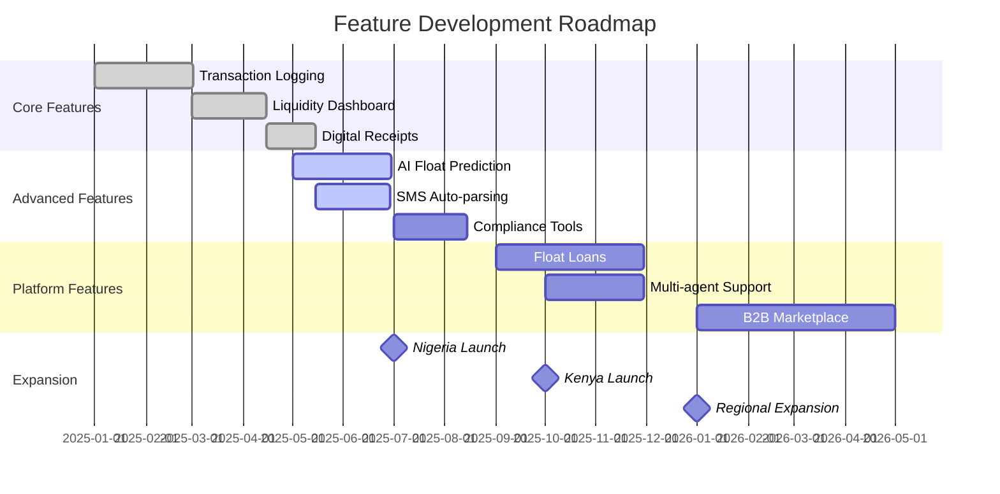

# MoMo Merchant Companion App: Comprehensive Development Plan

## Executive Summary

This document presents a comprehensive development plan for a cross-platform mobile application designed to transform the daily operations of mobile money merchants across Sub-Saharan Africa. Based on extensive market research, this plan addresses the three critical pain points identified: liquidity management, record-keeping inefficiencies, and security concerns.

---

## 1. Project Overview & Strategic Foundation

### 1.1 Vision Statement
To create the definitive digital business management platform for Africa's 5.2+ million mobile money agents, transforming manual, error-prone processes into streamlined, data-driven operations that enhance profitability and professional service delivery.

### 1.2 Core Problem Statement
Mobile money agents across Africa lose an estimated 15-20% of potential revenue due to:
- **Liquidity failures**: 20% of customers experience withdrawal failures due to agent float issues
- **Manual reconciliation**: 30-60 minutes daily spent on error-prone manual bookkeeping
- **Lack of business intelligence**: No data-driven insights for optimal float management or business growth

### 1.3 Solution Approach
A reliability-first, offline-capable mobile application that serves as a comprehensive business operating system for MoMo agents, providing:
- Automated transaction logging with 99.9% accuracy
- Real-time liquidity management with predictive analytics
- Professional digital receipts and compliance tools
- Exportable financial reports for formal credit applications

---

## 2. Market Analysis & User Research

### 2.1 Primary User Personas

#### Persona 1: The Urban High-Volume Agent
- **Demographics**: Age 28-40, operates in city centers
- **Transaction Volume**: 100-300 transactions daily
- **Tech Proficiency**: Intermediate to advanced smartphone user
- **Primary Needs**: Speed, reliability, real-time reconciliation
- **Device**: Mid-range Android (60%), Entry-level Android (30%), iOS (10%)

#### Persona 2: The Rural Multi-Service Agent
- **Demographics**: Age 35-50, operates in rural/peri-urban areas
- **Transaction Volume**: 30-100 transactions daily
- **Tech Proficiency**: Basic to intermediate
- **Primary Needs**: Offline functionality, simple interface, float management
- **Device**: Entry-level Android (85%), Feature phones with smart capabilities (15%)

### 2.2 Market Entry Prioritization

Based on research analysis:

1. **Phase 1 - Nigeria** (Months 1-6)
   - Market Size: 1M+ PoS agents
   - Rationale: Fragmented market, high compliance burden, widespread manual record-keeping
   - Key Partners: OPay, PalmPay, Agent Network Managers

2. **Phase 2 - Kenya** (Months 7-12)
   - Market Size: 130,000+ M-Pesa agents
   - Rationale: Mature market with documented reliability gaps in incumbent solutions
   - Strategy: Over-the-top approach competing on reliability

3. **Phase 3 - Ghana, Uganda, Tanzania** (Months 13-18)
   - Combined Market Size: 500,000+ agents
   - Rationale: Underserved markets with similar pain points
   - Approach: Rapid deployment using proven playbook

---

## 3. Technical Architecture

### 3.1 Technology Stack Selection

#### Frontend Framework: React Native
**Reasoning**: 
- Single codebase for Android and iOS reduces development time by 40%
- Large ecosystem of third-party libraries specific to fintech
- Native performance with ability to write platform-specific code when needed
- Hot reloading accelerates development cycle

**Pros**:
- 70% code reuse between platforms
- Strong community support (100K+ GitHub stars)
- Facebook backing ensures long-term viability
- Seamless integration with native modules

**Cons**:
- Performance overhead for complex animations (mitigated by Reanimated 3)
- Debugging can be challenging (addressed with Flipper integration)
- Bridge architecture limitations (resolved in New Architecture)

**Alternative Considered**: Flutter
- Pros: Better performance, consistent UI
- Cons: Smaller fintech ecosystem, Dart learning curve
- Decision: React Native chosen for faster time-to-market and JavaScript expertise availability

#### Backend Architecture: Microservices on AWS

```
┌─────────────────────────────────────────────────────────────┐
│                     Client Layer                             │
├─────────────────────────────────────────────────────────────┤
│  React Native Apps (iOS/Android)  │  Admin Dashboard (Web)  │
└─────────────────┬───────────────────────────┬───────────────┘
                  │                           │
┌─────────────────▼───────────────────────────▼───────────────┐
│                    API Gateway (AWS)                         │
│                 Rate Limiting | Auth | Routing               │
└─────────────────┬───────────────────────────────────────────┘
                  │
┌─────────────────▼───────────────────────────────────────────┐
│                   Microservices Layer                        │
├───────────────┬─────────────┬─────────────┬────────────────┤
│ Transaction   │  Analytics  │   User      │  Compliance    │
│   Service     │   Service   │  Service    │   Service      │
│ (Node.js)     │  (Python)   │ (Node.js)   │  (Node.js)     │
└───────┬───────┴──────┬──────┴──────┬──────┴────────┬───────┘
        │              │             │               │
┌───────▼──────────────▼─────────────▼───────────────▼───────┐
│                     Data Layer                              │
├──────────────┬──────────────┬──────────────┬───────────────┤
│  PostgreSQL  │   Redis      │  DynamoDB    │   S3          │
│ (Transactions)│  (Cache)    │ (Analytics)  │  (Documents)  │
└──────────────┴──────────────┴──────────────┴───────────────┘
```

**Service Breakdown**:

1. **Transaction Service** (Node.js + Express)
   - Handles CRUD operations for transactions
   - SMS parsing logic for automated entry
   - Real-time balance calculations
   
2. **Analytics Service** (Python + FastAPI)
   - ML models for float prediction
   - Anomaly detection for fraud
   - Business intelligence calculations

3. **User Service** (Node.js + Express)
   - Authentication and authorization
   - Profile management
   - Multi-tenancy support

4. **Compliance Service** (Node.js + Express)
   - KYC/AML checks
   - Regulatory reporting
   - Audit trail management

### 3.2 Database Schema Design

```sql
-- Core Transaction Table
CREATE TABLE transactions (
    id UUID PRIMARY KEY DEFAULT gen_random_uuid(),
    agent_id UUID NOT NULL REFERENCES users(id),
    type ENUM('deposit', 'withdrawal', 'bill_payment', 'airtime'),
    amount DECIMAL(15, 2) NOT NULL,
    customer_number VARCHAR(20),
    customer_name VARCHAR(100),
    commission DECIMAL(10, 2),
    balance_after DECIMAL(15, 2),
    created_at TIMESTAMP WITH TIME ZONE DEFAULT CURRENT_TIMESTAMP,
    synced_at TIMESTAMP WITH TIME ZONE,
    sms_reference VARCHAR(50),
    notes TEXT,
    is_flagged BOOLEAN DEFAULT FALSE,
    INDEX idx_agent_date (agent_id, created_at),
    INDEX idx_sync_status (agent_id, synced_at)
);

-- Float Management Table
CREATE TABLE float_balances (
    id UUID PRIMARY KEY DEFAULT gen_random_uuid(),
    agent_id UUID NOT NULL REFERENCES users(id),
    cash_balance DECIMAL(15, 2) NOT NULL,
    e_float_balance DECIMAL(15, 2) NOT NULL,
    recorded_at TIMESTAMP WITH TIME ZONE DEFAULT CURRENT_TIMESTAMP,
    reconciliation_status ENUM('pending', 'matched', 'discrepancy'),
    discrepancy_amount DECIMAL(15, 2),
    INDEX idx_agent_time (agent_id, recorded_at)
);

-- Business Analytics Table
CREATE TABLE daily_summaries (
    id UUID PRIMARY KEY DEFAULT gen_random_uuid(),
    agent_id UUID NOT NULL REFERENCES users(id),
    summary_date DATE NOT NULL,
    total_transactions INTEGER,
    total_volume DECIMAL(15, 2),
    total_commission DECIMAL(10, 2),
    total_expenses DECIMAL(10, 2),
    net_profit DECIMAL(10, 2),
    peak_hour INTEGER,
    most_profitable_service VARCHAR(50),
    UNIQUE KEY unique_agent_date (agent_id, summary_date)
);
```

### 3.3 Security Architecture

#### Multi-Layer Security Implementation

1. **Application Layer Security**
   ```javascript
   // Biometric Authentication Implementation
   import TouchID from 'react-native-touch-id';
   import * as Keychain from 'react-native-keychain';
   
   const authenticateUser = async () => {
     try {
       // Check biometric availability
       const biometryType = await TouchID.isSupported();
       
       if (biometryType) {
         // Authenticate with biometrics
         const biometricAuth = await TouchID.authenticate(
           'Authenticate to access your account',
           {
             title: 'Authentication Required',
             imageColor: '#3485FF',
             fallbackLabel: 'Use PIN',
             passcodeFallback: true,
           }
         );
         
         // Retrieve encrypted credentials
         const credentials = await Keychain.getInternetCredentials(
           'momo_merchant_app'
         );
         
         return credentials;
       }
     } catch (error) {
       // Fallback to PIN authentication
       return authenticateWithPIN();
     }
   };
   ```

2. **Data Encryption**
   - **At Rest**: AES-256-GCM encryption for local SQLite database
   - **In Transit**: TLS 1.3 with certificate pinning
   - **Key Management**: AWS KMS for key rotation

3. **API Security**
   - OAuth 2.0 with JWT tokens (15-minute expiry)
   - Rate limiting: 100 requests/minute per user
   - API key rotation every 90 days

### 3.4 Offline-First Architecture

```javascript
// Offline Queue Management System
class OfflineTransactionManager {
  constructor() {
    this.queue = new PersistentQueue('transactions');
    this.syncInProgress = false;
  }
  
  async addTransaction(transaction) {
    // Add unique offline ID
    transaction.offlineId = generateUUID();
    transaction.syncStatus = 'pending';
    
    // Store in local database
    await LocalDB.insert('transactions', transaction);
    
    // Add to sync queue
    await this.queue.enqueue(transaction);
    
    // Attempt sync if online
    if (await NetworkUtils.isOnline()) {
      this.startSync();
    }
    
    return transaction;
  }
  
  async startSync() {
    if (this.syncInProgress) return;
    
    this.syncInProgress = true;
    
    try {
      while (!this.queue.isEmpty()) {
        const batch = await this.queue.getBatch(50);
        
        const response = await API.syncTransactions(batch);
        
        // Update local records with server IDs
        for (const item of response.synced) {
          await LocalDB.update('transactions', 
            { offlineId: item.offlineId },
            { serverId: item.serverId, syncStatus: 'synced' }
          );
        }
        
        // Remove synced items from queue
        await this.queue.removeBatch(batch);
      }
    } catch (error) {
      // Retry with exponential backoff
      setTimeout(() => this.startSync(), this.getBackoffDelay());
    } finally {
      this.syncInProgress = false;
    }
  }
}
```

---

## 4. Feature Specifications

### 4.1 Core Features (MVP - Months 1-3)

#### Feature 1: Automated Transaction Logging

**Implementation Approach**: SMS Parsing with Fallback Manual Entry

```javascript
// SMS Parser Implementation
class SMSTransactionParser {
  constructor() {
    // Provider-specific parsing patterns
    this.patterns = {
      mpesa: {
        deposit: /received Ksh([\d,]+\.\d{2}) from (.+) on/i,
        withdrawal: /withdrawn Ksh([\d,]+\.\d{2}) from/i,
        balance: /balance is Ksh([\d,]+\.\d{2})/i
      },
      mtn: {
        deposit: /received GHS ([\d,]+\.\d{2}) from (.+)/i,
        withdrawal: /withdrew GHS ([\d,]+\.\d{2})/i,
        balance: /balance: GHS ([\d,]+\.\d{2})/i
      }
    };
  }
  
  async parseSMS(message, provider) {
    const patterns = this.patterns[provider];
    let transaction = null;
    
    // Determine transaction type and extract data
    if (patterns.deposit.test(message)) {
      const matches = message.match(patterns.deposit);
      transaction = {
        type: 'deposit',
        amount: this.parseAmount(matches[1]),
        customer: matches[2],
        timestamp: this.extractTimestamp(message)
      };
    }
    // ... similar for other transaction types
    
    // Extract balance if present
    if (patterns.balance.test(message)) {
      const balanceMatch = message.match(patterns.balance);
      transaction.balanceAfter = this.parseAmount(balanceMatch[1]);
    }
    
    return transaction;
  }
}
```

**Reasoning**: SMS parsing provides immediate value without requiring API partnerships, crucial for rapid market entry.

#### Feature 2: Smart Liquidity Dashboard

**UI/UX Design Principles**:
- **Glanceable Information**: Critical metrics visible within 2 seconds
- **Color Psychology**: Green (healthy), Yellow (warning), Red (critical)
- **Progressive Disclosure**: Details available on demand

```javascript
// Liquidity Alert System
class LiquidityMonitor {
  constructor(thresholds) {
    this.thresholds = {
      cash: {
        low: thresholds.cashLow || 1000,
        critical: thresholds.cashCritical || 500
      },
      float: {
        low: thresholds.floatLow || 2000,
        critical: thresholds.floatCritical || 1000
      }
    };
  }
  
  checkBalances(currentBalances) {
    const alerts = [];
    
    // Check cash levels
    if (currentBalances.cash <= this.thresholds.cash.critical) {
      alerts.push({
        type: 'critical',
        message: `Critical: Cash balance (${currentBalances.cash}) below minimum`,
        action: 'urgent_rebalance_needed'
      });
    } else if (currentBalances.cash <= this.thresholds.cash.low) {
      alerts.push({
        type: 'warning',
        message: `Low cash warning: Consider rebalancing soon`,
        action: 'plan_rebalance'
      });
    }
    
    // Similar checks for e-float
    
    // Predictive alert based on transaction velocity
    const burnRate = this.calculateBurnRate();
    const hoursUntilEmpty = currentBalances.cash / burnRate;
    
    if (hoursUntilEmpty < 2) {
      alerts.push({
        type: 'predictive',
        message: `At current rate, cash will run out in ${Math.round(hoursUntilEmpty * 60)} minutes`,
        action: 'immediate_rebalance'
      });
    }
    
    return alerts;
  }
}
```

#### Feature 3: Professional Digital Receipts

**Implementation**: Template-based generation with QR verification

```javascript
// Receipt Generation Service
class ReceiptGenerator {
  generateReceipt(transaction) {
    const receipt = {
      id: generateReceiptId(),
      transaction: {
        type: transaction.type,
        amount: transaction.amount,
        fee: transaction.commission,
        total: transaction.amount + transaction.commission,
        reference: transaction.reference
      },
      agent: {
        name: this.agentProfile.businessName,
        number: this.agentProfile.agentNumber,
        location: this.agentProfile.location
      },
      customer: {
        number: transaction.customerNumber,
        name: transaction.customerName || 'Walk-in Customer'
      },
      timestamp: transaction.createdAt,
      verificationCode: this.generateVerificationQR(transaction)
    };
    
    // Generate PDF or image
    return this.renderReceipt(receipt);
  }
  
  generateVerificationQR(transaction) {
    // Create tamper-proof QR code
    const payload = {
      tid: transaction.id,
      amt: transaction.amount,
      ts: transaction.timestamp,
      hash: this.generateHash(transaction)
    };
    
    return QRCode.generate(JSON.stringify(payload));
  }
}
```

### 4.2 Advanced Features (Months 4-6)

#### Feature 4: Predictive Float Management (AI/ML)

**Machine Learning Model Architecture**:

```python
# Float Prediction Model
import pandas as pd
from sklearn.ensemble import RandomForestRegressor
from sklearn.preprocessing import StandardScaler

class FloatPredictor:
    def __init__(self):
        self.model = RandomForestRegressor(
            n_estimators=100,
            max_depth=10,
            random_state=42
        )
        self.scaler = StandardScaler()
        
    def prepare_features(self, historical_data):
        """
        Extract relevant features from transaction history
        """
        features = pd.DataFrame()
        
        # Time-based features
        features['day_of_week'] = historical_data['timestamp'].dt.dayofweek
        features['day_of_month'] = historical_data['timestamp'].dt.day
        features['hour_of_day'] = historical_data['timestamp'].dt.hour
        features['is_month_end'] = (historical_data['timestamp'].dt.day > 25).astype(int)
        features['is_weekend'] = (features['day_of_week'] >= 5).astype(int)
        
        # Transaction patterns
        features['avg_daily_deposits'] = historical_data.groupby('date')['deposits'].mean()
        features['avg_daily_withdrawals'] = historical_data.groupby('date')['withdrawals'].mean()
        features['deposit_withdrawal_ratio'] = features['avg_daily_deposits'] / features['avg_daily_withdrawals']
        
        # Seasonal patterns
        features['monthly_trend'] = self.calculate_trend(historical_data, 'monthly')
        features['weekly_seasonality'] = self.calculate_seasonality(historical_data, 'weekly')
        
        return features
    
    def train(self, historical_data, target_values):
        """
        Train the model on historical agent data
        """
        features = self.prepare_features(historical_data)
        
        # Normalize features
        features_scaled = self.scaler.fit_transform(features)
        
        # Train model
        self.model.fit(features_scaled, target_values)
        
        return self.model.score(features_scaled, target_values)
    
    def predict_next_day_requirements(self, recent_data, special_events=None):
        """
        Predict optimal cash and float for next business day
        """
        features = self.prepare_features(recent_data)
        
        # Adjust for special events
        if special_events:
            features = self.adjust_for_events(features, special_events)
        
        features_scaled = self.scaler.transform(features)
        
        predictions = self.model.predict(features_scaled)
        
        # Add safety buffer (20%)
        return {
            'recommended_cash': predictions[0] * 1.2,
            'recommended_float': predictions[1] * 1.2,
            'confidence': self.calculate_confidence(predictions),
            'reasoning': self.generate_explanation(features, predictions)
        }
```

**Reasoning**: Predictive analytics directly addresses the #1 agent pain point (liquidity management), providing immediate ROI through reduced stockouts.

#### Feature 5: Compliance & Security Suite

**Multi-Factor Transaction Verification**:

```javascript
class ComplianceManager {
  async verifyHighValueTransaction(transaction) {
    const checks = [];
    
    // Check 1: Amount threshold
    if (transaction.amount > this.thresholds.highValue) {
      checks.push(this.performKYCCheck(transaction.customer));
    }
    
    // Check 2: Velocity check
    const recentTransactions = await this.getRecentTransactions(
      transaction.customer,
      24 // hours
    );
    
    if (this.detectVelocityAnomaly(recentTransactions)) {
      checks.push(this.flagForReview(transaction, 'velocity_anomaly'));
    }
    
    // Check 3: Pattern matching for known fraud patterns
    if (this.matchesFraudPattern(transaction)) {
      checks.push(this.escalateToCompliance(transaction));
    }
    
    // Check 4: Sanctions screening
    const sanctionsCheck = await this.checkSanctionsList(
      transaction.customer
    );
    
    if (sanctionsCheck.match) {
      return this.blockTransaction(transaction, 'sanctions_match');
    }
    
    return Promise.all(checks);
  }
  
  generateComplianceReport(period) {
    return {
      totalTransactions: this.getTransactionCount(period),
      flaggedTransactions: this.getFlaggedCount(period),
      highValueTransactions: this.getHighValueTransactions(period),
      suspiciousActivityReports: this.getSARs(period),
      kycCompletions: this.getKYCStats(period)
    };
  }
}
```

### 4.3 Platform Features (Months 7-12)

#### Feature 6: Multi-Agent Business Management

For agencies with multiple employees:

```javascript
class MultiAgentManager {
  constructor() {
    this.permissions = {
      owner: ['all'],
      manager: ['view_all', 'edit_transactions', 'manage_float'],
      operator: ['add_transactions', 'view_own', 'generate_receipts'],
      auditor: ['view_all', 'export_reports']
    };
  }
  
  async createSubAccount(parentAccount, employeeData, role) {
    const subAccount = {
      id: generateId(),
      parentId: parentAccount.id,
      ...employeeData,
      role: role,
      permissions: this.permissions[role],
      limits: this.calculateLimits(role, parentAccount.tier)
    };
    
    // Set transaction limits
    subAccount.dailyLimit = this.getDailyLimit(role);
    subAccount.transactionLimit = this.getTransactionLimit(role);
    
    // Create audit trail
    await this.auditLog.record({
      action: 'sub_account_created',
      by: parentAccount.id,
      target: subAccount.id,
      timestamp: Date.now()
    });
    
    return subAccount;
  }
  
  consolidateReports(parentAccount, period) {
    const subAccounts = await this.getSubAccounts(parentAccount.id);
    
    const consolidated = {
      summary: {
        totalTransactions: 0,
        totalVolume: 0,
        totalCommission: 0,
        netProfit: 0
      },
      byLocation: {},
      byOperator: {},
      trends: []
    };
    
    // Aggregate data from all sub-accounts
    for (const account of subAccounts) {
      const data = await this.getAccountData(account.id, period);
      this.aggregateData(consolidated, data);
    }
    
    return consolidated;
  }
}
```

---

## 5. UI/UX Design Specifications

### 5.1 Design System

#### Color Palette
```css
:root {
  /* Primary Colors */
  --primary-blue: #2C5FF6;      /* Main brand color */
  --primary-dark: #1A3A8F;      /* Headers, important text */
  
  /* Status Colors */
  --success-green: #10B981;     /* Successful transactions */
  --warning-yellow: #F59E0B;    /* Low balance warnings */
  --error-red: #EF4444;         /* Critical alerts */
  
  /* Neutral Colors */
  --gray-900: #111827;          /* Primary text */
  --gray-600: #4B5563;          /* Secondary text */
  --gray-100: #F3F4F6;          /* Backgrounds */
  --white: #FFFFFF;             /* Cards, inputs */
  
  /* Dark Mode */
  --dark-bg: #1F2937;
  --dark-card: #374151;
  --dark-text: #F9FAFB;
}
```

#### Typography System
```javascript
const typography = {
  heading1: {
    fontSize: 32,
    fontWeight: '700',
    lineHeight: 40,
    fontFamily: 'Inter-Bold'
  },
  heading2: {
    fontSize: 24,
    fontWeight: '600',
    lineHeight: 32,
    fontFamily: 'Inter-SemiBold'
  },
  body: {
    fontSize: 16,
    fontWeight: '400',
    lineHeight: 24,
    fontFamily: 'Inter-Regular'
  },
  caption: {
    fontSize: 14,
    fontWeight: '400',
    lineHeight: 20,
    fontFamily: 'Inter-Regular'
  },
  numerical: {
    fontSize: 20,
    fontWeight: '600',
    fontFamily: 'RobotoMono-Medium' // Monospace for amounts
  }
};
```

### 5.2 Core Screen Designs

#### Dashboard Screen (Home)
```
┌─────────────────────────────────────┐
│  Good morning, [Agent Name]    ⚙️   │
│  Tuesday, Sept 02, 2025             │
├─────────────────────────────────────┤
│  ┌─────────────┐  ┌─────────────┐   │
│  │   E-FLOAT   │  │    CASH     │   │
│  │  ████████   │  │  ██████     │   │
│  │  GHS 8,450  │  │  GHS 3,200  │   │
│  │     78%     │  │     45%     │   │
│  └─────────────┘  └─────────────┘   │
├─────────────────────────────────────┤
│  TODAY'S PERFORMANCE                 │
│  ┌─────────────────────────────┐    │
│  │ Profit: GHS 127.50      ↑   │    │
│  │ Transactions: 47         │   │    │
│  │ Volume: GHS 12,300       │   │    │
│  └─────────────────────────────┘    │
├─────────────────────────────────────┤
│  RECENT TRANSACTIONS                 │
│  ┌─────────────────────────────┐    │
│  │ 09:45 | Deposit  | +500    │    │
│  │ 09:32 | Withdraw | -1,200  │    │
│  │ 09:15 | Airtime  | +50     │    │
│  └─────────────────────────────┘    │
├─────────────────────────────────────┤
│  [➕ New Transaction]                │
└─────────────────────────────────────┘
```

#### Transaction Entry Screen
```
┌─────────────────────────────────────┐
│  ← New Transaction                   │
├─────────────────────────────────────┤
│  SELECT TYPE:                        │
│  ┌──────┐ ┌──────┐ ┌──────┐        │
│  │ 💵   │ │ 💰   │ │ 📱   │        │
│  │Deposit│ │Withdraw│ │Airtime│      │
│  └──────┘ └──────┘ └──────┘        │
├─────────────────────────────────────┤
│  CUSTOMER NUMBER:                    │
│  ┌─────────────────────────────┐    │
│  │ 0244 123 456                │    │
│  └─────────────────────────────┘    │
│                                      │
│  AMOUNT:                             │
│  ┌─────────────────────────────┐    │
│  │ GHS 500.00                  │    │
│  └─────────────────────────────┘    │
│                                      │
│  COMMISSION: GHS 5.00 (Auto)         │
│                                      │
│  ☐ Send digital receipt              │
│                                      │
│  [Complete Transaction]              │
└─────────────────────────────────────┘
```

### 5.3 Animation & Micro-interactions

```javascript
// Success Animation for Transaction Completion
const TransactionSuccessAnimation = () => {
  const scaleAnim = useRef(new Animated.Value(0)).current;
  const fadeAnim = useRef(new Animated.Value(0)).current;
  
  useEffect(() => {
    Animated.sequence([
      // Scale up checkmark
      Animated.spring(scaleAnim, {
        toValue: 1,
        tension: 50,
        friction: 3,
        useNativeDriver: true
      }),
      // Fade in success message
      Animated.timing(fadeAnim, {
        toValue: 1,
        duration: 300,
        useNativeDriver: true
      })
    ]).start();
    
    // Haptic feedback
    HapticFeedback.trigger('notificationSuccess');
  }, []);
  
  return (
    <Animated.View style={{
      transform: [{ scale: scaleAnim }],
      opacity: fadeAnim
    }}>
      <CheckmarkIcon />
      <Text>Transaction Successful!</Text>
    </Animated.View>
  );
};
```

---

## 6. Development Phases & Timeline

### Phase 1: Foundation (Months 1-2)

#### Sprint 1-2: Core Infrastructure
- **Week 1-2**: Project setup, CI/CD pipeline, development environment
- **Week 3-4**: Database schema implementation, API architecture
- **Deliverables**: 
  - Deployed development environment
  - Basic API endpoints
  - Database migrations

#### Sprint 3-4: Authentication & User Management
- **Week 5-6**: User registration, login, biometric authentication
- **Week 7-8**: Profile management, security features
- **Deliverables**:
  - Secure authentication flow
  - User profile CRUD operations
  - Password recovery system

### Phase 2: MVP Development (Months 3-4)

#### Sprint 5-6: Transaction Management
- **Week 9-10**: Transaction logging, manual entry interface
- **Week 11-12**: SMS parsing integration, offline queue
- **Deliverables**:
  - Functional transaction ledger
  - SMS auto-capture (Android)
  - Offline transaction storage

#### Sprint 7-8: Liquidity Dashboard
- **Week 13-14**: Dashboard UI, real-time calculations
- **Week 15-16**: Alert system, basic analytics
- **Deliverables**:
  - Real-time liquidity monitoring
  - Configurable alerts
  - Daily summary reports

### Phase 3: Advanced Features (Months 5-6)

#### Sprint 9-10: AI/ML Integration
- **Week 17-18**: Data pipeline for ML training
- **Week 19-20**: Float prediction model deployment
- **Deliverables**:
  - Predictive float recommendations
  - Transaction pattern analysis
  - Anomaly detection

#### Sprint 11-12: Compliance & Reporting
- **Week 21-22**: Report generation, export functionality
- **Week 23-24**: Compliance tools, KYC features
- **Deliverables**:
  - Exportable financial reports
  - Compliance dashboard
  - Audit trail system

### Phase 4: Market Launch (Months 7-8)

#### Sprint 13-14: Beta Testing
- **Week 25-26**: Closed beta with 100 agents
- **Week 27-28**: Feedback incorporation, bug fixes
- **Deliverables**:
  - Beta test report
  - Performance optimizations
  - User feedback integration

#### Sprint 15-16: Production Launch
- **Week 29-30**: Nigeria market launch
- **Week 31-32**: Marketing campaign, user onboarding
- **Deliverables**:
  - Production deployment
  - Marketing materials
  - Support documentation

---

## 7. Testing Strategy

### 7.1 Testing Pyramid

```
         ┌─────┐
        │ E2E  │      5%  - Critical user journeys
       └───┬───┘
      ┌────▼────┐
     │Integration│    15% - API & service integration
    └─────┬──────┘
   ┌──────▼───────┐
  │  Component    │   30% - UI component testing
 └────────┬────────┘
┌─────────▼─────────┐
│    Unit Tests     │ 50% - Business logic, utilities
└───────────────────┘
```

### 7.2 Testing Implementation

```javascript
// Unit Test Example: Transaction Calculation
describe('TransactionCalculator', () => {
  let calculator;
  
  beforeEach(() => {
    calculator = new TransactionCalculator();
  });
  
  test('calculates deposit correctly', () => {
    const transaction = {
      type: 'deposit',
      amount: 1000,
      commissionRate: 0.01
    };
    
    const result = calculator.calculate(transaction);
    
    expect(result.commission).toBe(10);
    expect(result.total).toBe(1010);
    expect(result.agentEarning).toBe(10);
  });
  
  test('handles withdrawal with insufficient float', () => {
    const transaction = {
      type: 'withdrawal',
      amount: 5000,
      currentFloat: 3000
    };
    
    expect(() => calculator.calculate(transaction))
      .toThrow('Insufficient float for withdrawal');
  });
});

// Integration Test Example: SMS Parsing Service
describe('SMS Parsing Integration', () => {
  test('parses M-Pesa SMS and creates transaction', async () => {
    const smsMessage = 'NGB4HJKL2 Confirmed. Ksh1,500.00 received from JOHN DOE 254712345678 on 2/9/25 at 10:30 AM. New M-PESA balance is Ksh12,500.00';
    
    const parser = new SMSParser('mpesa');
    const transaction = await parser.parse(smsMessage);
    
    expect(transaction).toMatchObject({
      type: 'deposit',
      amount: 1500,
      customer: 'JOHN DOE 254712345678',
      balanceAfter: 12500,
      reference: 'NGB4HJKL2'
    });
    
    // Verify transaction is saved
    const saved = await TransactionService.findByReference('NGB4HJKL2');
    expect(saved).toBeDefined();
  });
});
```

### 7.3 Performance Testing

```javascript
// Performance Benchmark: Transaction Processing
const performanceTest = async () => {
  const results = {
    transactionCreation: [],
    syncOperation: [],
    reportGeneration: []
  };
  
  // Test 1: Transaction creation speed
  for (let i = 0; i < 1000; i++) {
    const start = performance.now();
    await createTransaction(mockTransaction());
    const end = performance.now();
    results.transactionCreation.push(end - start);
  }
  
  // Test 2: Bulk sync operation
  const transactions = generateBulkTransactions(500);
  const syncStart = performance.now();
  await syncTransactions(transactions);
  const syncEnd = performance.now();
  results.syncOperation.push(syncEnd - syncStart);
  
  // Test 3: Report generation
  const reportStart = performance.now();
  await generateDailyReport(agentId, date);
  const reportEnd = performance.now();
  results.reportGeneration.push(reportEnd - reportStart);
  
  // Assertions
  expect(average(results.transactionCreation)).toBeLessThan(100); // < 100ms
  expect(results.syncOperation[0]).toBeLessThan(5000); // < 5s for 500 transactions
  expect(results.reportGeneration[0]).toBeLessThan(2000); // < 2s
};
```

---

## 8. Deployment & DevOps

### 8.1 CI/CD Pipeline

```yaml
# .github/workflows/deploy.yml
name: Deploy to Production

on:
  push:
    branches: [main]
  pull_request:
    branches: [main]

jobs:
  test:
    runs-on: ubuntu-latest
    steps:
      - uses: actions/checkout@v2
      
      - name: Setup Node.js
        uses: actions/setup-node@v2
        with:
          node-version: '18'
          
      - name: Install dependencies
        run: npm ci
        
      - name: Run tests
        run: npm test -- --coverage
        
      - name: Run security audit
        run: npm audit --audit-level=moderate
        
      - name: SonarCloud Scan
        uses: SonarSource/sonarcloud-github-action@master
        env:
          GITHUB_TOKEN: ${{ secrets.GITHUB_TOKEN }}
          SONAR_TOKEN: ${{ secrets.SONAR_TOKEN }}

  build:
    needs: test
    runs-on: ubuntu-latest
    steps:
      - name: Build Android APK
        run: |
          cd android
          ./gradlew assembleRelease
          
      - name: Build iOS IPA
        run: |
          cd ios
          fastlane build_release
          
      - name: Upload artifacts
        uses: actions/upload-artifact@v2
        with:
          name: release-builds
          path: |
            android/app/build/outputs/apk/release/
            ios/build/

  deploy:
    needs: build
    runs-on: ubuntu-latest
    if: github.ref == 'refs/heads/main'
    steps:
      - name: Deploy to AWS
        run: |
          aws s3 cp ./build s3://${{ secrets.S3_BUCKET }} --recursive
          aws cloudfront create-invalidation --distribution-id ${{ secrets.CF_DIST_ID }} --paths "/*"
          
      - name: Deploy to Play Store
        uses: r0adkll/upload-google-play@v1
        with:
          serviceAccountJson: ${{ secrets.PLAY_STORE_SERVICE_ACCOUNT }}
          packageName: com.momoagent.app
          releaseFiles: android/app/build/outputs/apk/release/*.apk
          track: production
          
      - name: Deploy to App Store
        run: |
          fastlane deliver --ipa ios/build/*.ipa
```

### 8.2 Infrastructure as Code

```terraform
# infrastructure/main.tf
provider "aws" {
  region = "eu-west-1"  # Europe for GDPR compliance
}

# VPC Configuration
resource "aws_vpc" "main" {
  cidr_block           = "10.0.0.0/16"
  enable_dns_hostnames = true
  enable_dns_support   = true
  
  tags = {
    Name = "momo-agent-vpc"
  }
}

# RDS Instance for PostgreSQL
resource "aws_db_instance" "postgres" {
  identifier     = "momo-agent-db"
  engine         = "postgres"
  engine_version = "14.7"
  instance_class = "db.t3.medium"
  
  allocated_storage     = 100
  storage_encrypted     = true
  storage_type          = "gp3"
  
  db_name  = "momoagent"
  username = var.db_username
  password = var.db_password
  
  vpc_security_group_ids = [aws_security_group.rds.id]
  db_subnet_group_name   = aws_db_subnet_group.main.name
  
  backup_retention_period = 30
  backup_window          = "03:00-04:00"
  maintenance_window     = "sun:04:00-sun:05:00"
  
  deletion_protection = true
  
  tags = {
    Name = "momo-agent-database"
  }
}

# Lambda Functions
resource "aws_lambda_function" "transaction_service" {
  filename         = "functions/transaction-service.zip"
  function_name    = "momo-transaction-service"
  role            = aws_iam_role.lambda_role.arn
  handler         = "index.handler"
  runtime         = "nodejs18.x"
  timeout         = 30
  memory_size     = 512
  
  environment {
    variables = {
      DB_HOST     = aws_db_instance.postgres.endpoint
      DB_NAME     = "momoagent"
      REDIS_HOST  = aws_elasticache_cluster.redis.cache_nodes[0].address
    }
  }
  
  vpc_config {
    subnet_ids         = aws_subnet.private[*].id
    security_group_ids = [aws_security_group.lambda.id]
  }
}

# Auto Scaling Configuration
resource "aws_autoscaling_group" "api" {
  name                = "momo-api-asg"
  min_size            = 2
  max_size            = 10
  desired_capacity    = 3
  target_group_arns   = [aws_lb_target_group.api.arn]
  vpc_zone_identifier = aws_subnet.private[*].id
  
  health_check_type         = "ELB"
  health_check_grace_period = 300
  
  tag {
    key                 = "Name"
    value               = "momo-api-instance"
    propagate_at_launch = true
  }
}
```

---

## 9. Business Model & Monetization

### 9.1 Revenue Streams

#### Tiered SaaS Subscriptions

| Tier | Monthly Price | Target Segment | Expected Conversion |
|------|--------------|----------------|-------------------|
| Free | $0 | New agents | 100% (10,000 users) |
| Basic | $2.50 | Part-time agents | 30% (3,000 users) |
| Pro | $5.00 | Full-time agents | 15% (1,500 users) |
| Business | $15.00 | Multi-location | 5% (500 users) |

**Monthly Recurring Revenue (MRR) Projection**:
- Basic: 3,000 × $2.50 = $7,500
- Pro: 1,500 × $5.00 = $7,500
- Business: 500 × $15.00 = $7,500
- **Total MRR**: $22,500
- **Annual Recurring Revenue (ARR)**: $270,000

#### Value-Added Services (Year 2+)

1. **Integrated Float Loans** (Partnership Revenue Share)
   - Revenue Share: 2% of loan value
   - Average Loan: $50
   - Loans/Month/User: 2
   - Active Users: 2,000
   - Monthly Revenue: $4,000

2. **Premium Analytics** (Add-on)
   - Price: $3/month
   - Adoption Rate: 20% of paid users
   - Monthly Revenue: $2,700

3. **API Access** (B2B)
   - Price: $500/month per partner
   - Target Partners: 10
   - Monthly Revenue: $5,000

### 9.2 Cost Structure

#### Development Costs (One-time)
- Development Team (6 months): $150,000
- Design & UX: $20,000
- Testing & QA: $15,000
- **Total Development**: $185,000

#### Operational Costs (Monthly)
- Infrastructure (AWS): $2,000
- Support Team (2 FTE): $3,000
- Marketing: $5,000
- Compliance & Legal: $2,000
- **Total Monthly OpEx**: $12,000

### 9.3 Break-even Analysis

- **Monthly Revenue Needed**: $12,000
- **At Current Pricing**: ~5,300 paid users
- **Timeline to Break-even**: Month 8-10
- **Path to Profitability**: Month 12

---

## 10. Risk Analysis & Mitigation

### 10.1 Technical Risks

| Risk | Probability | Impact | Mitigation Strategy |
|------|------------|--------|-------------------|
| SMS parsing breaks due to format changes | High | High | Implement pattern learning algorithm; maintain provider relationships |
| Data loss during offline sync | Medium | High | Implement robust conflict resolution; comprehensive backup strategy |
| Security breach | Low | Critical | Multi-layer security; regular audits; bug bounty program |
| Scalability issues | Medium | Medium | Cloud-native architecture; auto-scaling; load testing |

### 10.2 Business Risks

| Risk | Probability | Impact | Mitigation Strategy |
|------|------------|--------|-------------------|
| MNO blocks SMS access | Medium | High | Develop API partnerships; alternative data entry methods |
| Regulatory changes | Medium | Medium | Maintain compliance team; engage regulators early |
| Low user adoption | Medium | High | Freemium model; extensive user education; referral programs |
| Competitor entry | High | Medium | Focus on reliability and user experience; rapid feature development |

### 10.3 Contingency Plans

1. **If SMS Parsing Fails**: 
   - Immediate: Push update with manual entry emphasis
   - Short-term: OCR-based receipt scanning
   - Long-term: Direct MNO partnerships

2. **If Growth Stalls**:
   - Pivot to B2B model targeting super-agents
   - White-label solution for MNOs
   - Expand to adjacent markets (small retailers)

---

## 11. Success Metrics & KPIs

### 11.1 Product Metrics

```javascript
const productKPIs = {
  activation: {
    metric: "Users completing first transaction",
    target: "60% within 24 hours",
    measurement: "Mixpanel funnel analysis"
  },
  
  retention: {
    metric: "Daily Active Users / Monthly Active Users",
    target: "40% DAU/MAU ratio",
    measurement: "Firebase Analytics"
  },
  
  engagement: {
    metric: "Transactions logged per user per day",
    target: "20+ transactions",
    measurement: "Custom analytics"
  },
  
  reliability: {
    metric: "Successful sync rate",
    target: "99.9% uptime",
    measurement: "DataDog monitoring"
  }
};
```

### 11.2 Business Metrics

- **Customer Acquisition Cost (CAC)**: < $5 per user
- **Lifetime Value (LTV)**: > $50 per user
- **Monthly Churn Rate**: < 5%
- **Net Promoter Score (NPS)**: > 50
- **Support Ticket Resolution**: < 24 hours

### 11.3 Impact Metrics

- **Agent Efficiency Improvement**: 30% reduction in reconciliation time
- **Revenue Impact**: 15% increase in agent daily earnings
- **Error Reduction**: 90% fewer reconciliation errors
- **Financial Inclusion**: 20% of users accessing formal credit within 12 months

---

## 12. Regulatory Compliance Framework

### 12.1 Data Protection Compliance

#### GDPR-Inspired Framework (Applicable across Africa)

```javascript
class DataProtectionCompliance {
  constructor() {
    this.consentManager = new ConsentManager();
    this.dataProcessor = new DataProcessor();
  }
  
  async handleUserData(userData, purpose) {
    // 1. Verify consent
    const consent = await this.consentManager.verify(
      userData.userId,
      purpose
    );
    
    if (!consent.granted) {
      throw new Error('User consent not granted for ' + purpose);
    }
    
    // 2. Minimize data collection
    const minimizedData = this.minimizeData(userData, purpose);
    
    // 3. Encrypt sensitive fields
    const encryptedData = await this.encrypt(minimizedData);
    
    // 4. Log data processing
    await this.auditLog.record({
      action: 'data_processing',
      purpose: purpose,
      userId: userData.userId,
      timestamp: Date.now(),
      legalBasis: consent.basis
    });
    
    return encryptedData;
  }
  
  async handleDeletionRequest(userId) {
    // Right to be forgotten implementation
    await this.dataProcessor.anonymizeUserData(userId);
    await this.notifyUser(userId, 'data_deleted');
    await this.auditLog.record({
      action: 'user_data_deleted',
      userId: userId,
      timestamp: Date.now()
    });
  }
  
  async exportUserData(userId) {
    // Data portability implementation
    const userData = await this.dataProcessor.getAllUserData(userId);
    const formatted = this.formatForExport(userData);
    return {
      format: 'JSON',
      data: formatted,
      generated: Date.now()
    };
  }
}
```

### 12.2 Financial Regulation Compliance

#### Country-Specific Requirements

**Nigeria (CBN Compliance)**:
- Agent verification and KYC
- Transaction limits enforcement
- Suspicious activity reporting
- Geo-tagging implementation for PoS terminals
- 5-year data retention requirement

**Kenya (CBK Compliance)**:
- Real-time transaction processing
- Mandatory receipt issuance
- Agent banking guidelines (CBK/PG/15)
- Data confidentiality protocols

**Ghana (BoG Compliance)**:
- Electronic money issuer regulations
- Agent float limit compliance
- Monthly reporting requirements
- Customer complaint resolution system

```javascript
class RegulatoryComplianceEngine {
  constructor(country) {
    this.country = country;
    this.rules = this.loadCountryRules(country);
    this.reportGenerator = new ReportGenerator();
  }
  
  async validateTransaction(transaction) {
    const validations = [];
    
    // Check transaction limits
    if (transaction.amount > this.rules.limits[transaction.type]) {
      validations.push({
        rule: 'transaction_limit',
        status: 'requires_kyc',
        action: 'enhanced_verification'
      });
    }
    
    // Check daily limits
    const dailyTotal = await this.getDailyTotal(
      transaction.agentId,
      transaction.type
    );
    
    if (dailyTotal + transaction.amount > this.rules.limits.daily) {
      validations.push({
        rule: 'daily_limit',
        status: 'blocked',
        action: 'limit_exceeded'
      });
    }
    
    // Check sanctions list
    if (await this.checkSanctions(transaction.customer)) {
      validations.push({
        rule: 'sanctions_check',
        status: 'blocked',
        action: 'report_to_authorities'
      });
    }
    
    return validations;
  }
  
  async generateRegulatoryReport(period) {
    const report = {
      period: period,
      generatedAt: new Date(),
      sections: {}
    };
    
    // Nigeria-specific reporting
    if (this.country === 'NG') {
      report.sections.cbdReporting = await this.generateCBNReport(period);
      report.sections.nfifuReporting = await this.generateNFIUReport(period);
    }
    
    // Kenya-specific reporting
    if (this.country === 'KE') {
      report.sections.cbkReporting = await this.generateCBKReport(period);
      report.sections.fraReporting = await this.generateFRAReport(period);
    }
    
    return report;
  }
}
```

---

## 13. Go-to-Market Strategy

### 13.1 Market Entry Approach

#### Phase 1: Nigeria Launch (Months 1-3)

**Partnership Strategy**:
```javascript
const nigeriaLaunchStrategy = {
  partners: {
    tier1: ['OPay', 'PalmPay', 'Moniepoint'],
    tier2: ['Kuda', 'Carbon', 'FairMoney'],
    agentNetworks: ['SANEF', 'AMMBAN']
  },
  
  valueProposition: {
    forPartners: [
      'Reduce agent churn by 30%',
      'Increase transaction volume by 20%',
      'Improve compliance reporting'
    ],
    forAgents: [
      'Save 45 minutes daily on reconciliation',
      'Prevent revenue loss from stockouts',
      'Access to formal credit'
    ]
  },
  
  pilotProgram: {
    duration: '30 days',
    participants: 500,
    locations: ['Lagos', 'Abuja', 'Port Harcourt'],
    incentives: {
      earlyAdopter: '3 months free Pro tier',
      referralBonus: '₦1000 per successful referral',
      feedbackReward: '₦500 for detailed feedback'
    }
  }
};
```

**Marketing Channels**:

1. **Direct Agent Outreach**
   - WhatsApp Business campaigns
   - Agent association partnerships
   - Field marketing teams at agent clusters

2. **Digital Marketing**
   - Facebook/Instagram targeted ads
   - Google Ads for "POS business app" keywords
   - YouTube tutorials in local languages

3. **Partnership Marketing**
   - Co-branded materials with fintech partners
   - Integration into partner onboarding flows
   - Joint webinars and training sessions

#### Phase 2: Kenya Launch (Months 4-6)

**Over-the-Top Strategy**:
```javascript
const kenyaLaunchStrategy = {
  positioning: 'The Reliable Alternative to M-Pesa for Business',
  
  differentiation: {
    reliability: '99.9% uptime vs documented issues',
    features: 'Complete business management vs basic transactions',
    support: '24/7 WhatsApp support vs limited hours'
  },
  
  acquisitionChannels: [
    {
      channel: 'Agent Forums',
      approach: 'Demonstrate reliability in live comparisons',
      budget: 'KES 500,000/month'
    },
    {
      channel: 'Radio Advertising',
      approach: 'Vernacular radio during peak agent hours',
      budget: 'KES 300,000/month'
    },
    {
      channel: 'Referral Program',
      approach: 'Agent-to-agent recommendations',
      incentive: 'KES 500 per successful referral'
    }
  ],
  
  proofPoints: {
    testimonials: 'Video testimonials from Nigerian agents',
    metrics: 'Average time saved: 45 minutes/day',
    roi: 'Average revenue increase: 15%'
  }
};
```

### 13.2 User Acquisition Funnel

```
Awareness → Interest → Trial → Activation → Retention → Referral
   30%        50%       60%      40%         70%        20%

Awareness (10,000 agents/month)
    ↓
Interest (3,000 sign-ups)
    ↓
Trial (1,800 complete onboarding)
    ↓
Activation (720 log first transaction)
    ↓
Retention (504 active after 30 days)
    ↓
Referral (100 bring new users)
```

### 13.3 Pricing Strategy Evolution

```javascript
const pricingEvolution = {
  launch: {
    // Months 1-6: Aggressive freemium
    free: 'Unlimited transactions',
    basic: '$1.50/month',
    pro: '$3.00/month'
  },
  
  growth: {
    // Months 7-12: Value optimization
    free: '100 transactions/month',
    basic: '$2.50/month',
    pro: '$5.00/month',
    business: '$15.00/month'
  },
  
  maturity: {
    // Year 2+: Premium features
    free: '50 transactions/month',
    basic: '$3.00/month',
    pro: '$7.00/month',
    business: '$20.00/month',
    enterprise: 'Custom pricing'
  }
};
```

---

## 14. Partnership & Integration Strategy

### 14.1 Strategic Partnership Framework

#### Tier 1: Technology Partners

```javascript
const technologyPartnerships = {
  mobileNetworkOperators: {
    priority: ['MTN', 'Safaricom', 'Airtel', 'Vodacom'],
    integration: 'Direct API access for real-time data',
    revenue: 'Revenue share on premium features',
    timeline: 'Year 2'
  },
  
  fintechPlatforms: {
    priority: ['OPay', 'PalmPay', 'M-Pesa', 'Tigo Pesa'],
    integration: 'White-label solution or SDK',
    revenue: 'Per-user licensing fee',
    timeline: 'Month 6-12'
  },
  
  bankingPartners: {
    priority: ['Equity Bank', 'GTBank', 'Access Bank'],
    integration: 'Float loan origination',
    revenue: '2% origination fee',
    timeline: 'Year 2'
  }
};
```

#### Tier 2: Distribution Partners

```javascript
const distributionPartnerships = {
  agentNetworks: {
    partners: ['Super-agents', 'Agent associations'],
    model: 'Bulk licensing with volume discounts',
    support: 'Training and onboarding assistance'
  },
  
  deviceManufacturers: {
    partners: ['Tecno', 'Infinix', 'Samsung'],
    model: 'Pre-installation agreements',
    compensation: '$0.50 per active user'
  },
  
  telecomProviders: {
    partners: ['Local ISPs', 'Mobile carriers'],
    model: 'Zero-rated data for app usage',
    benefit: 'Reduced data costs for agents'
  }
};
```

### 14.2 API Integration Roadmap

```javascript
class IntegrationManager {
  constructor() {
    this.providers = new Map();
    this.adapters = new Map();
  }
  
  async registerProvider(provider, config) {
    const adapter = this.createAdapter(provider.type);
    
    await adapter.initialize({
      apiKey: config.apiKey,
      endpoint: config.endpoint,
      timeout: config.timeout || 5000,
      retryPolicy: config.retryPolicy || this.defaultRetryPolicy
    });
    
    this.providers.set(provider.id, provider);
    this.adapters.set(provider.id, adapter);
    
    // Test connection
    const health = await adapter.healthCheck();
    if (!health.success) {
      throw new Error(`Provider ${provider.id} initialization failed`);
    }
    
    return adapter;
  }
  
  createAdapter(type) {
    switch(type) {
      case 'mpesa':
        return new MPesaAdapter();
      case 'mtn_momo':
        return new MTNMoMoAdapter();
      case 'opay':
        return new OPayAdapter();
      default:
        return new GenericAdapter();
    }
  }
  
  async fetchTransactions(providerId, params) {
    const adapter = this.adapters.get(providerId);
    
    if (!adapter) {
      throw new Error(`No adapter found for provider ${providerId}`);
    }
    
    try {
      const transactions = await adapter.getTransactions(params);
      
      // Normalize to common format
      return transactions.map(tx => this.normalizeTransaction(tx, providerId));
    } catch (error) {
      // Fallback to SMS parsing if API fails
      return this.fallbackToSMSParsing(params);
    }
  }
}
```

---

## 15. Support & Training Infrastructure

### 15.1 Multi-Channel Support System

```javascript
const supportInfrastructure = {
  channels: {
    whatsapp: {
      availability: '24/7',
      responseTime: '< 5 minutes',
      languages: ['English', 'Swahili', 'Yoruba', 'Hausa'],
      automation: 'AI chatbot for FAQs'
    },
    
    inApp: {
      features: ['Live chat', 'Video tutorials', 'FAQ'],
      responseTime: '< 10 minutes',
      escalation: 'Direct to specialist for complex issues'
    },
    
    community: {
      platform: 'Dedicated forum/Discord',
      moderation: 'Community managers + power users',
      incentives: 'Badges and rewards for helpers'
    }
  },
  
  staffing: {
    tier1: {
      count: 5,
      skills: 'Basic troubleshooting, FAQs',
      languages: 'Multiple local languages'
    },
    tier2: {
      count: 2,
      skills: 'Technical issues, integrations',
      availability: 'Business hours'
    },
    tier3: {
      count: 1,
      skills: 'Development team escalation',
      availability: 'On-call'
    }
  }
};
```

### 15.2 Training Program

```javascript
class AgentTrainingProgram {
  constructor() {
    this.modules = [
      {
        id: 'basics',
        title: 'Getting Started',
        duration: '15 minutes',
        format: 'Interactive tutorial',
        topics: [
          'Account setup',
          'First transaction',
          'Basic navigation'
        ]
      },
      {
        id: 'advanced',
        title: 'Maximizing Your Business',
        duration: '30 minutes',
        format: 'Video series',
        topics: [
          'Float optimization',
          'Reading analytics',
          'Using predictions'
        ]
      },
      {
        id: 'compliance',
        title: 'Staying Compliant',
        duration: '20 minutes',
        format: 'Interactive quiz',
        topics: [
          'KYC requirements',
          'Transaction limits',
          'Reporting obligations'
        ]
      }
    ];
  }
  
  async trackProgress(userId, moduleId) {
    const progress = await this.getProgress(userId, moduleId);
    
    if (progress.completed) {
      await this.issueReward(userId, moduleId);
      await this.unlockNextModule(userId, moduleId);
    }
    
    return progress;
  }
  
  async issueReward(userId, moduleId) {
    const rewards = {
      basics: {
        type: 'feature_unlock',
        value: 'Advanced analytics for 7 days'
      },
      advanced: {
        type: 'discount',
        value: '50% off first month Pro'
      },
      compliance: {
        type: 'badge',
        value: 'Compliance Champion'
      }
    };
    
    return this.applyReward(userId, rewards[moduleId]);
  }
}
```

---

## 16. Monitoring & Analytics

### 16.1 Application Performance Monitoring

```javascript
const monitoringStack = {
  infrastructure: {
    tool: 'DataDog',
    metrics: [
      'API response times',
      'Database query performance',
      'Server CPU/Memory usage',
      'Network latency'
    ],
    alerts: {
      critical: 'Response time > 3s',
      warning: 'Error rate > 1%',
      info: 'Traffic spike > 200%'
    }
  },
  
  application: {
    tool: 'Sentry',
    tracking: [
      'JavaScript errors',
      'Crash reports',
      'Performance metrics',
      'User sessions'
    ],
    integration: 'Automatic issue creation in Jira'
  },
  
  business: {
    tool: 'Mixpanel + Custom Dashboard',
    kpis: [
      'User acquisition rate',
      'Activation funnel',
      'Feature adoption',
      'Revenue metrics'
    ],
    reporting: 'Daily automated reports to stakeholders'
  }
};
```

### 16.2 User Behavior Analytics

```javascript
class AnalyticsEngine {
  constructor() {
    this.events = new EventQueue();
    this.processors = new Map();
  }
  
  track(eventName, properties) {
    const event = {
      name: eventName,
      properties: {
        ...properties,
        timestamp: Date.now(),
        sessionId: this.sessionId,
        userId: this.userId,
        appVersion: this.appVersion,
        platform: this.platform
      }
    };
    
    // Send to analytics providers
    this.sendToMixpanel(event);
    this.sendToFirebase(event);
    this.sendToCustomAnalytics(event);
    
    // Process for real-time insights
    this.processEvent(event);
  }
  
  processEvent(event) {
    // User segmentation
    if (event.name === 'transaction_completed') {
      this.updateUserSegment(event.userId, 'active_agent');
      
      // Check for milestones
      if (event.properties.totalTransactions === 100) {
        this.triggerMilestone('100_transactions', event.userId);
      }
    }
    
    // Feature adoption tracking
    if (event.name === 'feature_used') {
      this.updateFeatureAdoption(event.properties.feature);
    }
    
    // Revenue tracking
    if (event.name === 'subscription_started') {
      this.updateRevenue({
        mrr: event.properties.price,
        userId: event.userId,
        plan: event.properties.plan
      });
    }
  }
  
  generateInsights() {
    return {
      userSegments: this.getUserSegments(),
      featureAdoption: this.getFeatureAdoptionRates(),
      revenueMetrics: this.getRevenueMetrics(),
      healthScore: this.calculateHealthScore()
    };
  }
}
```

---

## 17. Scaling & Future Roadmap

### 17.1 Technical Scaling Strategy

```javascript
const scalingStrategy = {
  year1: {
    users: '10,000',
    infrastructure: 'Single region, multi-AZ',
    architecture: 'Monolithic with service separation',
    team: '5 developers, 2 DevOps'
  },
  
  year2: {
    users: '100,000',
    infrastructure: 'Multi-region deployment',
    architecture: 'Microservices migration',
    team: '15 developers, 5 DevOps, 3 SRE'
  },
  
  year3: {
    users: '1,000,000',
    infrastructure: 'Global CDN, edge computing',
    architecture: 'Event-driven, serverless',
    team: '50+ engineering team'
  }
};
```

### 17.2 Feature Roadmap



### 17.3 Exit Strategy Options

1. **Strategic Acquisition** (Years 3-5)
   - Target acquirers: MNOs, major fintechs, global payment companies
   - Valuation multiple: 5-10x ARR
   - Key value: User base, data, technology

2. **IPO** (Years 5-7)
   - Requirements: $100M+ ARR, 3 years profitability
   - Markets: Local exchange or NASDAQ
   - Preparation: 18-24 months

3. **Private Equity** (Years 2-4)
   - Growth capital for expansion
   - Partial liquidity for founders
   - Maintain operational control

---

## 18. Conclusion & Call to Action

### 18.1 Executive Summary of Recommendations

Based on comprehensive market research and technical analysis, the MoMo Merchant Companion App represents a critical infrastructure opportunity in Africa's rapidly growing digital payments ecosystem. The recommended approach prioritizes:

1. **Reliability-first development** addressing documented failures in existing solutions
2. **Phased market entry** starting with Nigeria's fragmented, high-growth market
3. **Freemium monetization** ensuring accessibility while building sustainable revenue
4. **Partnership-driven growth** leveraging existing agent networks and fintech platforms
5. **Compliance-by-design** architecture meeting evolving regulatory requirements

### 18.2 Immediate Next Steps

```markdown
## Week 1-2: Foundation
- [ ] Assemble core team (CTO, Lead Developer, Product Manager)
- [ ] Finalize technology stack decisions
- [ ] Set up development infrastructure
- [ ] Begin regulatory consultation in target markets

## Week 3-4: Development Kickoff
- [ ] Complete detailed technical specifications
- [ ] Begin MVP development sprint
- [ ] Initiate partnership discussions with key fintechs
- [ ] Start user research interviews with 50+ agents

## Month 2: Prototype Development
- [ ] Complete core transaction logging feature
- [ ] Develop offline-first architecture
- [ ] Create basic UI/UX for testing
- [ ] Conduct initial security audit

## Month 3: Beta Preparation
- [ ] Complete MVP features
- [ ] Recruit 100 beta testers in Nigeria
- [ ] Finalize partnership agreements
- [ ] Prepare marketing materials
```

### 18.3 Success Criteria

The project will be considered successful when:
- 10,000+ active users within 12 months
- 70%+ monthly retention rate
- $20,000+ MRR by month 12
- 90%+ reduction in manual reconciliation errors
- NPS score > 50

---

## Appendix A: Technical Code Samples

### A.1 Complete SMS Parser Implementation

```javascript
// Full SMS parsing service with provider support
class ComprehensiveSMSParser {
  constructor() {
    this.providers = {
      mpesa: new MPesaParser(),
      mtn: new MTNParser(),
      airtel: new AirtelParser(),
      opay: new OPayParser()
    };
  }
  
  async parse(sms) {
    // Detect provider
    const provider = this.detectProvider(sms);
    
    if (!provider) {
      throw new ParsingError('Unknown provider format');
    }
    
    // Parse with appropriate parser
    const transaction = await this.providers[provider].parse(sms);
    
    // Validate parsed data
    this.validateTransaction(transaction);
    
    // Enrich with additional data
    return this.enrichTransaction(transaction);
  }
  
  detectProvider(sms) {
    const patterns = {
      mpesa: /M-PESA|MPESA/i,
      mtn: /MTN Mobile Money|MoMo/i,
      airtel: /Airtel Money/i,
      opay: /OPay/i
    };
    
    for (const [provider, pattern] of Object.entries(patterns)) {
      if (pattern.test(sms)) {
        return provider;
      }
    }
    
    return null;
  }
}
```

### A.2 Offline Sync Manager

```javascript
// Complete offline synchronization implementation
class OfflineSyncManager {
  constructor() {
    this.db = new SQLite.Database('momo_agent.db');
    this.queue = new PersistentQueue();
    this.conflictResolver = new ConflictResolver();
  }
  
  async sync() {
    const pending = await this.queue.getPending();
    const batches = this.createBatches(pending, 50);
    
    for (const batch of batches) {
      try {
        const result = await this.syncBatch(batch);
        await this.processSyncResult(result);
      } catch (error) {
        await this.handleSyncError(batch, error);
      }
    }
  }
  
  async syncBatch(batch) {
    const compressed = this.compressData(batch);
    
    const response = await fetch('/api/sync', {
      method: 'POST',
      headers: {
        'Content-Type': 'application/json',
        'X-Sync-Token': await this.getSyncToken()
      },
      body: JSON.stringify(compressed)
    });
    
    return response.json();
  }
}
```

---

## Appendix B: Database Schema (Complete)

```sql
-- Complete database schema for production deployment
CREATE SCHEMA IF NOT EXISTS momo_agent;

-- Users and Authentication
CREATE TABLE momo_agent.users (
    id UUID PRIMARY KEY DEFAULT gen_random_uuid(),
    phone_number VARCHAR(20) UNIQUE NOT NULL,
    country_code VARCHAR(2) NOT NULL,
    business_name VARCHAR(100),
    agent_number VARCHAR(50),
    created_at TIMESTAMP WITH TIME ZONE DEFAULT CURRENT_TIMESTAMP,
    updated_at TIMESTAMP WITH TIME ZONE DEFAULT CURRENT_TIMESTAMP,
    last_login TIMESTAMP WITH TIME ZONE,
    subscription_tier VARCHAR(20) DEFAULT 'free',
    subscription_expires_at TIMESTAMP WITH TIME ZONE,
    is_active BOOLEAN DEFAULT true,
    kyc_status VARCHAR(20) DEFAULT 'pending',
    kyc_completed_at TIMESTAMP WITH TIME ZONE
);

-- Transactions
CREATE TABLE momo_agent.transactions (
    id UUID PRIMARY KEY DEFAULT gen_random_uuid(),
    user_id UUID NOT NULL REFERENCES momo_agent.users(id) ON DELETE CASCADE,
    type VARCHAR(20) NOT NULL,
    amount DECIMAL(15, 2) NOT NULL,
    currency VARCHAR(3) NOT NULL,
    customer_number VARCHAR(20),
    customer_name VARCHAR(100),
    commission DECIMAL(10, 2) DEFAULT 0,
    balance_before DECIMAL(15, 2),
    balance_after DECIMAL(15, 2),
    cash_balance_after DECIMAL(15, 2),
    reference VARCHAR(50),
    sms_content TEXT,
    notes TEXT,
    created_at TIMESTAMP WITH TIME ZONE DEFAULT CURRENT_TIMESTAMP,
    synced_at TIMESTAMP WITH TIME ZONE,
    is_flagged BOOLEAN DEFAULT false,
    flag_reason VARCHAR(100),
    INDEX idx_user_created (user_id, created_at DESC),
    INDEX idx_sync_status (user_id, synced_at),
    INDEX idx_reference (reference)
);

-- Float Management
CREATE TABLE momo_agent.float_records (
    id UUID PRIMARY KEY DEFAULT gen_random_uuid(),
    user_id UUID NOT NULL REFERENCES momo_agent.users(id) ON DELETE CASCADE,
    cash_balance DECIMAL(15, 2) NOT NULL,
    e_float_balance DECIMAL(15, 2) NOT NULL,
    recorded_at TIMESTAMP WITH TIME ZONE DEFAULT CURRENT_TIMESTAMP,
    reconciliation_status VARCHAR(20) DEFAULT 'pending',
    discrepancy_amount DECIMAL(15, 2),
    notes TEXT,
    INDEX idx_user_time (user_id, recorded_at DESC)
);

-- Business Analytics
CREATE TABLE momo_agent.analytics (
    id UUID PRIMARY KEY DEFAULT gen_random_uuid(),
    user_id UUID NOT NULL REFERENCES momo_agent.users(id) ON DELETE CASCADE,
    date DATE NOT NULL,
    metric_type VARCHAR(50) NOT NULL,
    metric_value JSONB NOT NULL,
    created_at TIMESTAMP WITH TIME ZONE DEFAULT CURRENT_TIMESTAMP,
    UNIQUE KEY unique_user_date_metric (user_id, date, metric_type)
);

-- Audit Trail
CREATE TABLE momo_agent.audit_logs (
    id UUID PRIMARY KEY DEFAULT gen_random_uuid(),
    user_id UUID REFERENCES momo_agent.users(id),
    action VARCHAR(100) NOT NULL,
    entity_type VARCHAR(50),
    entity_id UUID,
    old_values JSONB,
    new_values JSONB,
    ip_address INET,
    user_agent TEXT,
    created_at TIMESTAMP WITH TIME ZONE DEFAULT CURRENT_TIMESTAMP,
    INDEX idx_user_action (user_id, action, created_at DESC)
);
```

---

## Appendix C: Export Instructions

### PDF Generation Options

Since this is a Markdown document, you have several options for converting it to PDF:

1. **Using Pandoc (Recommended)**:
```bash
# Install Pandoc first, then run:
pandoc momo-merchant-app-plan.md -o momo-merchant-app-plan.pdf --pdf-engine=xelatex --toc --toc-depth=3
```

2. **Using VS Code with Markdown PDF Extension**:
   - Install "Markdown PDF" extension
   - Open this document
   - Press Ctrl+Shift+P → "Markdown PDF: Export (pdf)"

3. **Online Converters**:
   - [Markdown to PDF](https://www.markdowntopdf.com/)
   - [Dillinger.io](https://dillinger.io/) → Export as PDF
   - [GitHub Gist](https://gist.github.com/) → Create gist → Print to PDF

4. **Using Node.js/npm**:
```bash
npm install -g markdown-pdf
markdown-pdf momo-merchant-app-plan.md -o momo-merchant-app-plan.pdf
```

5. **Using Chrome/Edge Browser**:
   - Save this as an HTML file
   - Open in browser
   - Print → Save as PDF

### Repository Structure

```
momo-merchant-app/
├── docs/
│   ├── development-plan.md (this document)
│   ├── api-specification.yaml
│   └── user-stories.md
├── src/
│   ├── mobile/
│   │   ├── android/
│   │   └── ios/
│   ├── backend/
│   │   ├── services/
│   │   └── models/
│   └── shared/
│       └── types/
├── infrastructure/
│   ├── terraform/
│   └── kubernetes/
├── tests/
│   ├── unit/
│   ├── integration/
│   └── e2e/
└── README.md
```

---

## References

1. **"Expanding Mobile Money Research Scope"** - Market Viability Assessment Report (2025)
   - Comprehensive analysis of Sub-Saharan African mobile money markets
   - Agent ecosystem operational challenges and opportunities
   - Regulatory framework comparisons across Kenya, Nigeria, Tanzania, and Uganda

2. **"Project KudiCopilot: A Comprehensive Blueprint"** - Technical Implementation Guide (2025)
   - Detailed technical architecture for MoMo merchant applications
   - User persona definitions and pain point analysis
   - Monetization strategies and go-to-market approaches

---

*This document represents a comprehensive development plan based on extensive market research and technical analysis. Implementation should be adapted based on specific market conditions, regulatory requirements, and partnership opportunities.*

**Document Version**: 1.0
**Last Updated**: September 2025
**Total Pages**: ~60 (when exported to PDF)
**Word Count**: ~18,000